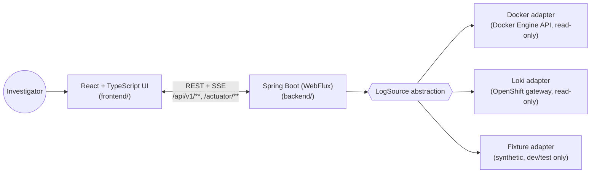

# Log Explorer

Log Explorer is a Seq-like investigation UI for structured Spring Boot JSON
logs, over three logical sources — a local Docker Compose stack (via the
Docker Engine API), an OpenShift Loki gateway, and an in-process synthetic
Fixture source for development/demo — served from a single deployable image
with no application database.

Built for developers and support engineers who need to answer ordinary
questions ("what failed in the last 30 minutes", "what happened for this
user", "follow this request across services") without hand-inspecting
`docker logs`, writing raw LogQL, or manually correlating trace/correlation
IDs by eye — and without ever exposing a raw sensitive value (CIF, username,
customer ID, device ID, device IP, and a conservative set of free-text
patterns like card numbers, tokens, and passwords) while doing it.

> Neutral identity only — "Log Explorer" / "Multi-Source Log Explorer". No
> production-readiness claim: this is a project built out incrementally
> (phases, then a series of "Legacy Remediation" slices), each with a real,
> honestly-reported verification pass. See [Project status](#project-status).

## Use cases

- **"What failed recently?"** — pick a service, a time window, Errors-only
  severity, and get a scannable table of failures, no raw JSON required.
- **"What happened for this customer/session?"** — search by a pasted
  identifier (auto-detected, never silently trusted) and see every matching
  event with `User/Customer` shown safely masked.
- **"Follow this request across services."** — open the event inspector on
  any row, click its trace/correlation/journey ID, and get an ascending,
  cross-service timeline — with an explicit "this does not indicate
  causality" disclaimer, since ordering isn't proof of a call graph.
- **"What else happened around this exact moment?"** — a bounded `±30s`
  context view around any single event, scoped to the same service/
  container/pod.
- **"Watch it happen live."** — a real-time, Server-Sent-Events tail for
  sources that support it, bounded and clearly distinct from historical
  search.

## Architecture



Every response crosses exactly one masking boundary before it ever reaches
`React` — see [Security & redaction](#security--redaction) below and
**[`docs/development/ARCHITECTURE.md`](docs/development/ARCHITECTURE.md)**
for the full component map and every deployment shape (Docker Compose,
OpenShift, Windows desktop) with diagrams. For the exact request/response
flow through every layer (historical search, Live, context/journey), see
**[`docs/development/BACKEND_FRONTEND_INTEGRATION.md`](docs/development/BACKEND_FRONTEND_INTEGRATION.md)**.

- **Backend**: Java 21, Spring Boot 3 (WebFlux, reactive end to end), Maven.
  `backend/src/main/java/com/logexplorer/` — see
  **[`backend/README.md`](backend/README.md)** for the backend developer guide.
- **Frontend**: React 19 + TypeScript (strict) + Vite. `frontend/src/` — see
  **[`frontend/README.md`](frontend/README.md)** for the frontend developer guide.
- **One deployable image**: the frontend's production build is embedded as
  the backend's own static resources (see `Dockerfile`) and served with an
  SPA fallback that never swallows `/api/**` or `/actuator/**` — no
  separate frontend server, no reverse proxy required in production. The
  Windows desktop app (below) embeds the exact same backend, launched
  locally instead of in a container.
- **No application database.** Sources are queried live; nothing is
  persisted server-side. The only thing the browser ever persists is a
  small set of safe, non-sensitive UI preferences (table column order/
  density) — see [Security & redaction](#security--redaction).

## Features

- **Bounded historical search** across a selected source, with service
  multi-select, severity filter, universal search (with confirmable ID
  detection), advanced filters grouped by question, and precise time-range
  handling (presets, a custom-range popover, exact interval + zone display).
- **A truthful, exactly-eight-column results table** — Time, Level, Service,
  What happened, Tags, User/Customer, Correlation/Trace, Actions — newest
  first, reorderable/hideable/density-adjustable (persisted safely, see
  below), with honest, non-contradictory counts (total/returned/visible/
  truncated).
- **An event inspector** — five stable baseline tabs (Overview, Actor &
  client, Request flow, Business, Technical / all fields) plus a sixth,
  conditional Error tab that appears only when the event actually carries
  error information (ERROR/FATAL severity, a real exception, or a real
  error code). Business holds business-domain data only, never
  exception/stack-trace content. An event with error information also gets
  an Error Summary near the top of Overview (severity, error code, exception
  type/message where available, a readable multiline preview) with a jump to
  the full Error tab, which holds the complete, readable, preserved-
  whitespace exception/stack trace. Plus a bounded `±30s` context view, and
  safe copy/find-related actions on non-sensitive IDs only.
- **Trace / correlation / journey investigation** — click a non-sensitive ID
  to open an ascending, cross-service timeline, with an explicit "this does
  not indicate causality" disclaimer.
- **Live tail** — start/pause/resume/stop a real-time stream (Server-Sent
  Events) for sources that support it, with a bounded 1,000-event display
  cap and honest dropped/buffered counts, visually distinct from historical
  search.
- **A centralized keyboard-shortcut registry** and a shortcuts-help popover
  that always reflects the real, currently-registered bindings — never a
  hand-maintained list that can drift out of sync.
- **Security by construction**: five structured sensitive fields (`cif`,
  `UserName`, `CustomerId`, `deviceId`, `deviceIp`) are masked server-side
  at a single boundary before any response leaves the backend; a
  conservative, server-side free-text redaction pass additionally catches
  high-confidence patterns (Luhn-valid card numbers, bearer tokens,
  password key=value pairs) inside message/exception text. Raw values,
  search terms, and tokens are never logged, never put in a URL, and never
  persisted client-side. Docker and OpenShift access are both strictly
  read-only (list / inspect / read logs / follow logs — never
  start/stop/create/remove/exec). TLS verification is always on, with no
  trust-all option anywhere in the codebase.
- **Explicit, honest source capabilities** — the backend reports what each
  source can actually do (live tail, raw LogQL, service discovery, …); the
  frontend never infers or fakes a capability a source doesn't really have.

## Repository structure

```
backend/    Spring Boot backend (parsing, masking, guardrails, source adapters, API) - see backend/README.md
frontend/   React + TypeScript UI - see frontend/README.md
desktop/    Windows standalone desktop app (WebView2 launcher + packaging) - see "Windows desktop distribution" below
tools/      Standalone verification-harness components (demo log generator, mock Loki)
docs/       Requirements handover, run guide, security notes, architecture/integration docs, per-slice verification reports
deploy/     OpenShift deployment manifests (Deployment, Service, ConfigMap, ServiceAccount)
scripts/    Deterministic verification scripts (smoke test, offline image export/import, standalone-jar build + packaged-jar smoke test) - Bash (.sh) and PowerShell (.ps1) versions of each, where both exist
```

## Quick start — standalone JAR (recommended)

The whole application — frontend and backend — ships as **one runnable
Spring Boot jar**. Java is the only thing you need installed; there is no
separate frontend server, no separate backend process, and no Docker
requirement to run it.

### 1. Requirements

- **Java 21 or newer** ([Temurin](https://adoptium.net/) is the tested
  distribution).
- **OpenShift access** (cluster URL, and a way to run `oc login` or get its
  output from someone who can) — only if you intend to connect to a real
  OpenShift source. Not needed for the bundled Fixture demo data.
- **Company network / VPN** — only if your OpenShift cluster requires one to
  reach it; not needed to start the app itself.
- **The jar itself**: this repository does not (yet) publish a standalone
  jar as a GitHub Release asset — only the Windows/macOS desktop installers
  are published that way (see [Windows desktop distribution](#windows-desktop-distribution)
  below). Build it yourself from a checkout, run from the repository root.
  Java 21 and Node/npm are both required *to build it* (never to run the
  finished jar — that still needs only Java 21). The jar is always written
  to `dist-jar/`.

  Windows (PowerShell — no Git Bash or WSL required):
  ```powershell
  .\scripts\build-jar.ps1
  ```
  Behind a corporate proxy, pass it in for this one build only — it is
  never written to any persistent npm/Maven/Windows configuration, and only
  applies to this build's own child processes:
  ```powershell
  .\scripts\build-jar.ps1 -ProxyUrl "http://proxy.company.local:8080"
  ```
  With an optional no-proxy list:
  ```powershell
  .\scripts\build-jar.ps1 -ProxyUrl "http://proxy.company.local:8080" -NoProxy "localhost,127.0.0.1,.company.local"
  ```

  Linux / macOS:
  ```bash
  ./scripts/build-jar.sh
  ```

  Either way, this produces `dist-jar/log-explorer-<version>.jar`. If your
  team publishes built jars somewhere internal (an artifact repository, a CI
  build artifact from the `JAR Smoke` workflow), get it from there instead.
- Verify your installed Java version: `java -version` — the first line must
  say `21` or higher.

### 2. Export the OpenShift certificate (only if your cluster uses a private/internal CA)

Skip this whole section if `java -jar` already connects to your OpenShift
cluster without a certificate error — most public-CA clusters need nothing
extra. If you do see a TLS/certificate error (see
[Troubleshooting](#6-basic-troubleshooting) below), export the cluster's
certificate once, from a Windows browser (Edge or Chrome):

1. Open your OpenShift console or API URL in the browser (the same
   `https://api.<your-cluster>...` address you'd pass to `oc login`).
2. Click the padlock icon in the address bar → **Connection is secure** →
   **Certificate is valid** (Chrome/Edge both use this same flow).
3. In the certificate viewer, open the **Details** tab, select the
   **root/issuing CA** certificate in the hierarchy shown, then
   **Copy to File…** (Windows certificate export wizard).
4. Choose **Base-64 encoded X.509 (.CER)**, and save it somewhere you can
   find again, e.g. `C:\Users\<you>\Downloads\openshift-ca.cer`.

### 3. Import the OpenShift certificate

Import it into the truststore of the **same Java installation** that will
run the jar:

```powershell
keytool -importcert -alias openshift-ca -file "C:\Users\<you>\Downloads\openshift-ca.cer" -keystore "%JAVA_HOME%\lib\security\cacerts" -storepass changeit
```

(Linux/macOS: `-file ~/Downloads/openshift-ca.cer -keystore "$JAVA_HOME/lib/security/cacerts"`.)

- When prompted `Trust this certificate? [no]:`, type **yes** and press
  Enter to confirm the import.
- Verify it took effect:
  ```powershell
  keytool -list -alias openshift-ca -keystore "%JAVA_HOME%\lib\security\cacerts" -storepass changeit
  ```
  This should print the certificate's fingerprint, not an error.
- If the command fails with something like *"Access is denied"* or
  *"keystore was tampered with"*, run the terminal **as Administrator**
  (Windows) or with `sudo` (Linux/macOS) — the default `cacerts` file is
  usually not writable by a normal user.
- `changeit` is the JDK's well-known default `cacerts` password, not a
  secret — never a real credential. This never disables TLS verification
  or relaxes hostname checking; it only adds one trusted issuer, exactly
  the same effect real browsers get from your OS's own certificate store.
- Alternative, no-`keytool` option: if you'd rather not touch the JVM's own
  truststore, you can instead add `--certificate-authority=<path-to-the-
  exported-.cer-file>` directly to the `oc login` command you paste into
  Log Explorer's own OpenShift connection form (see step 4 below) — the
  backend reads that one file as an extra trusted CA for that connection
  only. The `keytool` import above is the more durable, one-time fix and
  is what the rest of this guide assumes.

### 4. Run the application

```bash
java -jar log-explorer-<version>.jar
```

- Open **<http://localhost:3434>** — 3434 is the default port.
- **Different port**: set `SERVER_PORT` before starting, e.g.
  `SERVER_PORT=8080 java -jar log-explorer-<version>.jar` (PowerShell:
  `$env:SERVER_PORT=8080; java -jar log-explorer-<version>.jar`).
- **Stop it**: close the terminal window, or press `Ctrl+C` in it — the
  backend shuts down gracefully.
- **Data and configuration**: classification rules and other local state
  are written under `./data` next to wherever you ran the jar from, unless
  you set `LOGEXPLORER_DATA_DIR` to somewhere else. Nothing is written
  until you actually save something (e.g. your first classification rule).
- **Connecting to OpenShift / authenticating**: click **OpenShift** in the
  app's own top-right corner and paste your `oc login` command (the app
  reads `--server`/`--token`/`--certificate-authority` out of it — it never
  runs `oc` itself, and the token is held in memory only, never written to
  disk). Full detail: [`docs/user-guide/USER_GUIDE_EN.md` §5](docs/user-guide/USER_GUIDE_EN.md#5-openshift--connecting-and-using-it).

### 5. Upgrade to the latest version

1. Stop the running application (`Ctrl+C`, or close its window).
2. Obtain or build the new jar (`./scripts/build-jar.sh` again, from an
   updated checkout, or your team's own distribution point).
3. Replace the old `log-explorer-<old-version>.jar` file with the new one.
4. Run it the same way: `java -jar log-explorer-<new-version>.jar`.
5. **Local data is preserved** as long as you run the new jar from the same
   working directory (or keep the same `LOGEXPLORER_DATA_DIR`) — the data
   location is derived from where you run the jar, never from its filename
   or version, so classification rules and other local state carry over
   automatically. (Verified directly against `application.yml`'s own
   `LOGEXPLORER_DATA_DIR`-derived path — not assumed.)

### 6. Basic troubleshooting

| Problem | Fix |
|---|---|
| `'java' is not recognized` / `java: command not found` | Install [Temurin 21](https://adoptium.net/) and ensure it's on your `PATH`; reopen your terminal afterward. |
| Unsupported Java version | Run `java -version`; it must report `21` or higher. Older JDKs cannot run this jar. |
| `Port 3434 was already in use` (or similar) | Start with a different port: `SERVER_PORT=8080 java -jar log-explorer-<version>.jar`. |
| OpenShift certificate/trust error | Re-check the export/import steps above, then re-verify with `keytool -list -alias openshift-ca -keystore "%JAVA_HOME%\lib\security\cacerts" -storepass changeit`. Never work around this by disabling TLS verification — this application has no such option, by design. |
| Invalid or expired OpenShift token | Re-run `oc login` (or ask whoever manages cluster access for a fresh command) and paste the new command into the OpenShift connection form again. |
| The app URL doesn't open in the browser | Confirm the terminal shows a "Started LogExplorerApplication" line (the backend is actually up), that you're using `http://`, not `https://`, and that nothing else (a firewall, another local app) is blocking the port. |

This is the primary, fully self-contained way to run Log Explorer locally.
Docker Compose (below) remains available as a separate, optional deployment
mode — it is never required to run the jar above, and the jar is never
required to use Docker Compose.

## Docker Compose (optional)

Requires Docker Engine with Compose v2 (the `docker compose` subcommand).
No local Java or Node install needed — the whole build happens inside the
`Dockerfile`. Works identically on Linux, macOS, and Windows (Docker
Desktop) — nothing below needs WSL2, Git Bash, or Cygwin.

Windows PowerShell:

```powershell
git clone <this repository>
cd Log-explorer
Copy-Item .env.example .env
docker compose --profile demo up --build
```

Linux / macOS:

```bash
git clone <this repository>
cd Log-explorer
cp .env.example .env
docker compose --profile demo up --build
```

Open <http://localhost:3434>. This starts the app (with the in-process
**Fixture** source enabled — deterministic fake data, zero external
dependency) plus a deterministic demo log generator container. The app
itself only ever listens on `127.0.0.1` (see
[Production vs. development](#production-vs-development)).
Classification rules you create are stored in the `log-explorer-data`
named volume, which survives `docker compose down`/`up`; only
`docker compose down -v` removes it.

Full guide — every command below was actually run against this repository,
including real Docker container discovery and an offline OpenShift Loki
demo: **[docs/RUN_GUIDE.md](docs/RUN_GUIDE.md)**. Covers:

- The `docker-socket` profile (real, read-only Docker container discovery
  and log search/live-tail — mounted read-only, behind an explicit,
  doubly-gated opt-in, never silently).
- The `loki-mock` profile (an offline OpenShift Loki gateway stand-in).
- Pointing the same image at a real OpenShift Loki gateway or a remote
  Docker host.
- Every `LOGEXPLORER_*` / `SPRING_PROFILES_ACTIVE` environment variable —
  full reference in **[.env.example](.env.example)**.
- Offline image export/import for a machine with no registry access.
- Ports, health checks, troubleshooting.

Deterministic smoke test (build → start → health → source discovery →
search → UI load → stop → cleanup, limited to this stack only):

Windows PowerShell: `.\scripts\smoke.ps1` · Linux / macOS: `./scripts/smoke.sh`

## Windows desktop distribution

A standalone Windows application - `LogExplorer.exe` - for someone who just
wants to run Log Explorer locally without Docker or a browser tab:

```
LogExplorer.exe
  -> WinForms launcher (desktop/launcher)
  -> bundled Java runtime (jlink, no system Java required)
  -> the same Spring Boot backend, on 127.0.0.1, preferring port 3434
  -> an embedded WebView2 window (Microsoft Edge's engine, not a bundled
     browser) - never a plain "open Chrome to localhost" experience
```

Single-instance safe (a second launch activates the existing window rather
than starting a second backend), picks a free port automatically if 3434 is
taken by something else, and shuts the backend down cleanly - no orphaned
background process - when the window closes. See
**[`docs/development/ARCHITECTURE.md`](docs/development/ARCHITECTURE.md#windows-desktop-architecture)**
for the full startup/shutdown lifecycle and
**[`docs/verification/SLICE_9_WINDOWS_DESKTOP_REPORT.md`](docs/verification/SLICE_9_WINDOWS_DESKTOP_REPORT.md)**
for real build/packaging/smoke-test evidence from the `Windows Desktop` CI
workflow (`.github/workflows/windows-desktop.yml`), which builds and
verifies it on a real Windows runner on every relevant change - this
project has no local Windows machine of its own, so that hosted workflow
is the actual source of truth for whether the installer works, not a
claim taken on faith.

An installable `LogExplorer-<version>-windows-x64.exe` (Start Menu entry,
optional desktop shortcut, clean uninstall, per-user install - no admin
rights required) is produced by that same workflow; see the Windows
desktop report for where to get one from a given commit/tag.

Per-user data lives outside the install directory, so upgrades and
uninstall/reinstall keep it: backend logs in `%LOCALAPPDATA%\LogExplorer\logs`,
classification rules in `%LOCALAPPDATA%\LogExplorer\data`
(`~/Library/Application Support/LogExplorer/...` on macOS).

## Production vs. development

|  | Development | Production (Docker / OpenShift / Windows desktop) |
|---|---|---|
| Backend | `mvnw spring-boot:run` on **3434** | Same app, same port, embedded in the deployable artifact |
| Frontend | `npm run dev` (Vite) on **3435**, proxying `/api`/`/actuator` to 3434 | **No separate frontend server at all** - Spring Boot serves the built static assets directly |
| Backend bind address | `127.0.0.1` (the application's own default) | `127.0.0.1` for the Windows desktop app; `0.0.0.0` *inside* the container for Docker/OpenShift, with the host-side/Service boundary (not the process itself) scoping actual reachability - see `docker-compose.yml`'s own comment |

## Run locally (without Docker)

This is the **source/development** workflow — two live-reloading dev
servers from a checkout of this repository. If you just want to *run* the
application (no source checkout, no rebuilding on every change), use the
[standalone jar](#quick-start--standalone-jar-recommended) above instead;
that jar is what this exact frontend+backend pair build into.

Requires **Java 21** ([Temurin](https://adoptium.net/) works well on all
three platforms) and **Node.js 20+**. Two terminals — the frontend dev
server proxies `/api` and `/actuator` to the backend on port **3434**, so
both need to be running together.

**Important — set `SPRING_PROFILES_ACTIVE=dev` unless you specifically
want to query a real source.** Without it, the backend registers only the
real `local-docker` (via your local Docker Desktop/Engine) and
`openshift-loki` sources — no Fixture source, no demo data. This is a
common source of confusion when running locally for the first time: if
you start the backend with no active profile and search against
`local-docker`, it will genuinely try to read logs from whatever real
containers happen to be running on your machine.

**Backend** (starts on `:3434`; `SPRING_PROFILES_ACTIVE=dev` enables the
in-process Fixture source, the same zero-dependency demo data the Docker
quick start uses):

Windows PowerShell:

```powershell
cd backend
$env:SPRING_PROFILES_ACTIVE = "dev"
.\mvnw.cmd spring-boot:run
```

Linux / macOS:

```bash
cd backend
SPRING_PROFILES_ACTIVE=dev ./mvnw spring-boot:run
```

**Frontend** (starts on `:3435`; identical on every platform):

```bash
cd frontend
npm install
npm run dev
```

Open <http://localhost:3435>. Configuration is the same set of
`LOGEXPLORER_*` environment variables documented in `.env.example` — set
them in your shell (`$env:VAR = "value"` in PowerShell,
`export VAR=value` on macOS/Linux) before starting the backend to point it
at a real Docker socket or Loki gateway instead of the Fixture source.

## Testing

Windows PowerShell and Linux/macOS use the identical `npm` commands below;
the only platform-specific piece is the Maven wrapper (`mvnw.cmd` vs.
`./mvnw`) — a globally-installed Maven is never required either way.

```powershell
# Backend — 595 tests: parser, masking (structured + free-text redaction),
# guardrails, source adapters, query engine, cursor pagination, API
# integration, ArchUnit boundary, log/query-plan/token/cursor leak checks.
cd backend
.\mvnw.cmd test
```

```bash
# Backend — Linux/macOS
cd backend && ./mvnw test
```

```bash
# Frontend — 604 unit/component tests (Vitest + Testing Library + jest-axe).
# Identical on every platform.
cd frontend && npm run test

# Frontend strict type-check and production build.
cd frontend && npm run typecheck && npm run build

# Real-browser end-to-end (Playwright) — 171 tests across every slice,
# against a real running backend + frontend dev server.
cd frontend && npm run test:e2e
```

## Security & redaction

Sensitive values are removed **server-side, once, at a single boundary**
before a response ever reaches the browser — the frontend never sees a raw
value to accidentally leak, and never performs redaction itself. Two
layers:

1. **Structured masking** — five known sensitive fields (`cif`, `UserName`,
   `CustomerId`, `deviceId`, `deviceIp`) are always masked in the response
   DTO, regardless of source.
2. **Conservative free-text redaction** — a small set of high-confidence
   patterns (Luhn-valid card numbers, bearer/JWT tokens, `password=`-style
   key/value pairs) inside message/exception text, deliberately narrow so
   it never mangles an ordinary stack trace or log line.

Full detail (exact rules, what's deliberately *not* redacted and why,
performance bounds): **[docs/SECURITY_NOTES.md](docs/SECURITY_NOTES.md)**.
Client-side, the only thing ever written to `localStorage` is a small,
versioned, schema-validated table-preference object (column order/
visibility/density) — never a search value, a filter value, or a log
event; malformed stored preferences always fail safely back to defaults.
See `frontend/README.md`'s own "Safe preferences" section.

## Performance boundaries

A short list of invariants that are load-bearing product requirements, not
incidental behavior — see `backend/README.md`/`frontend/README.md` for the
code-level detail behind each:

- Live tail: a bounded 1,000-event display cap, bounded server-side buffer,
  batched (never one state update per event) frontend rendering, bounded/
  cancellable reconnect.
- Historical search: fresh, re-run against the selected source on every
  explicit Search click (never a filter over just the previously-loaded
  page), bounded page size/limits (500 events per page by default,
  `logexplorer.search.default-limit` / `LOGEXPLORER_SEARCH_DEFAULT_LIMIT`,
  capped by a hard `max-limit` of 5000), HMAC-signed opaque cursors (no raw
  offset/query leaked into a cursor), a bounded max time range. For Docker
  specifically, a bounded per-container progressive scan (up to
  `logexplorer.docker.max-historical-scan-chunks` rounds, default 5) lets a
  selective search reach genuinely older matching events beyond the first
  raw tail read, and honestly reports `truncated` rather than fabricating
  a total if its round budget runs out first.
- Frontend delivery: `JourneyView`/`LiveTailPanel` are code-split
  (`React.lazy`) since they're genuinely conditional secondary views; the
  primary Search → scan → inspect path is never lazy-loaded. See
  `docs/verification/SLICE_8_FRONTEND_PERFORMANCE_REPORT.md` for real
  bundle-size evidence.
- Docker/Loki adapters: bounded container/result counts, bounded request
  timeouts, no unbounded scans.

## Project status

Built incrementally against `IMPLEMENTATION_PLAN.md` (Phases A–L) and then
a series of "Legacy Remediation" slices restoring/upgrading capability
against the prior application it replaces, one branch and one pull request
each, with a real, honestly-reported verification pass before anything is
considered done (never "compilation is evidence" — see `CLAUDE.md`).

| Stage | Scope | Status |
|---|---|---|
| Phases A–L | Sources, parsing/masking, query engine, full search/inspector/journey/live UI, Docker Compose + OpenShift delivery | Done |
| Legacy Remediation Slices 1–6 | Pagination, query transparency, Docker settings UX, table configurability, Live resilience, investigation depth & source health | Done |
| Legacy Remediation Slice 7 | Conservative free-text sensitive-data redaction | Done |
| Legacy Remediation Slice 8 | Keyboard-shortcut registry, safe preference persistence, frontend delivery performance (code splitting) | Done |
| Legacy Remediation Slice 9 | Packaging, portability, Windows desktop distribution, cross-platform developer experience | This slice |
| Phase M | Final stakeholder acceptance | Not started |

Full per-requirement coverage: **[REQUIREMENTS_TRACEABILITY.md](REQUIREMENTS_TRACEABILITY.md)**.
Per-phase/per-slice verification reports (real commands, real output, honest
PASS/FAIL/BLOCKED/DEFERRED — never fabricated):
**`docs/verification/PHASE_<X>_REPORT.md`** /
**`docs/verification/LEGACY_REMEDIATION_SLICE_<N>_REPORT.md`**.

## Documentation map

| Document | What it's for |
|---|---|
| [`CLAUDE.md`](CLAUDE.md) | Non-negotiable operating rules (security, verification honesty, behavioral invariants) — read before touching this repo |
| [`HANDOVER.md`](HANDOVER.md) | Full requirements handover — product intent, architecture, UX decisions, constraints |
| [`IMPLEMENTATION_PLAN.md`](IMPLEMENTATION_PLAN.md) | The phase-by-phase build plan this project followed through Phase L |
| [`REQUIREMENTS_TRACEABILITY.md`](REQUIREMENTS_TRACEABILITY.md) | Every requirement mapped to its owning phase and evidence |
| [`docs/LEGACY_TO_NEW_VERIFIED_CAPABILITY_MATRIX.md`](docs/LEGACY_TO_NEW_VERIFIED_CAPABILITY_MATRIX.md) | Every capability the prior application had, reconciled against real evidence in this codebase |
| [`backend/README.md`](backend/README.md) | Backend developer guide — structure, "where do I change X", every major component's purpose/location/invariants |
| [`frontend/README.md`](frontend/README.md) | Frontend developer guide — structure, "where do I change X", state ownership, safe preferences, shortcuts |
| [`docs/development/ARCHITECTURE.md`](docs/development/ARCHITECTURE.md) | System overview, component maps, deployment architecture (Docker/OpenShift/Windows desktop), with diagrams |
| [`docs/development/BACKEND_FRONTEND_INTEGRATION.md`](docs/development/BACKEND_FRONTEND_INTEGRATION.md) | The exact request/response flow for historical search, Live, and context/journey, end to end |
| [`docs/RUN_GUIDE.md`](docs/RUN_GUIDE.md) | Full run guide — Docker Compose profiles, ports, env vars, offline export/import, troubleshooting |
| [`docs/SECURITY_NOTES.md`](docs/SECURITY_NOTES.md) | Full security posture across every deployment shape |
| [`.env.example`](.env.example) | Every configuration variable, with names and harmless defaults only |
| [`deploy/openshift/`](deploy/openshift/) | OpenShift manifests |
| `docs/verification/PHASE_<X>_REPORT.md`, `LEGACY_REMEDIATION_SLICE_<N>_REPORT.md` | Per-phase/per-slice verification reports |

## Out of scope

SSO / per-user OAuth, long-term log storage, SIEM, alerting, full APM, log
mutation, a cross-source single query, an application database,
cluster-wide permissions, saved/team queries, retention/DR, tracing-backend
integration, multi-cluster queries, AI root-cause diagnosis, analytics, and
production identity features are all explicitly out of scope — see
`CLAUDE.md` §8 for the full list and why.
