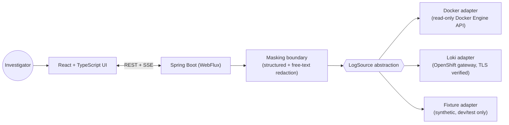
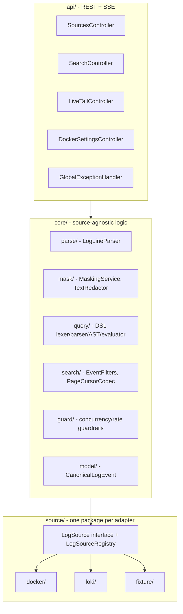
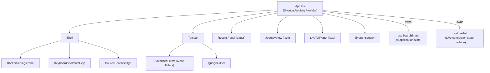
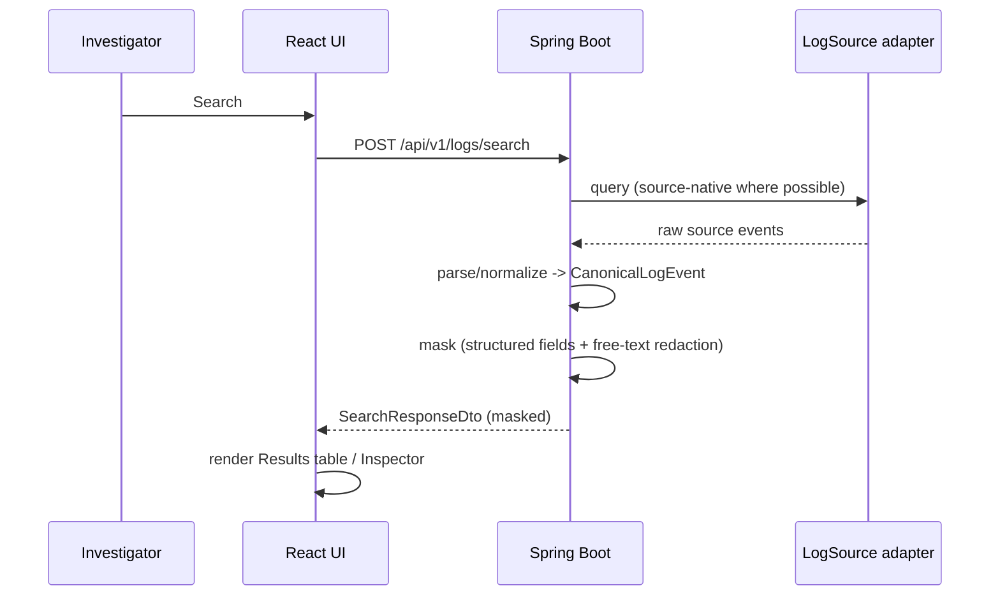

# Architecture

System overview, component maps, and every deployment shape. See
[`backend/README.md`](../../backend/README.md) and
[`frontend/README.md`](../../frontend/README.md) for the code-level
developer guides this document sits above, and
[`BACKEND_FRONTEND_INTEGRATION.md`](BACKEND_FRONTEND_INTEGRATION.md) for
the exact request/response flow through every layer.

## System overview



Every response leaving `Spring` for `React` has already crossed exactly
one masking boundary — there is no code path from an adapter's raw event
to an HTTP response body that skips it. The frontend never redacts
anything itself; it only ever renders what the backend already decided is
safe to show.

## Backend component map



Every controller depends on `LogSourceRegistry` (an interface-typed
collection), never a concrete adapter — enforced by `ArchitectureTest`
(ArchUnit), not just convention.

## Frontend component map



`useSearchState` is the one state owner almost every feature reads from
and calls into — there is no separate global store. `ResultsPanel` stays
eagerly bundled (the primary path); `JourneyView`/`LiveTailPanel` are
`React.lazy` since both are genuinely conditional and mutually exclusive
with it.

## Canonical data flow



The same shape (query → adapter → normalize → mask → DTO) is reused,
unchanged, for the `context` and `journey` endpoints — see the
integration doc for how each differs only in how the request is
constructed, not in this pipeline.

## Security boundaries

- **Masking boundary** (`core/mask/`): the one seam every response
  crosses; structurally cannot be bypassed (sensitive fields live in a
  nested `RawSensitiveFields` the DTO mapper never reads directly).
- **Docker read-only boundary** (`source/docker/ReadOnlyDockerClient`):
  the Docker client type itself only exposes list/inspect/read-logs/
  follow-logs methods — there is no method to call that would mutate
  anything, even by mistake.
- **Remote-Docker SSRF boundary** (`source/docker/security/`):
  default-deny for loopback/link-local/private-LAN/cloud-metadata
  addresses, explicit allowlist only.
- **Loki TLS boundary**: verification always on; a configured extra CA is
  additive, never a trust-all replacement.
- **Frontend persistence boundary**: exactly one `localStorage` call site
  (`tablePreferences.ts`), versioned and validated; everything else
  (queries, filters, results, credentials) never leaves memory. See
  `frontend/README.md`'s "Persistence rules".

## Deployment architecture

Five shapes, one backend, one frontend build:

```mermaid
flowchart TB
    subgraph docker["Docker / Docker Compose"]
        direction LR
        Host["Host: 127.0.0.1:3434"] --> Container["Container (0.0.0.0:3434 internally)"]
        Container --> AppJar1["app.jar\n(backend + embedded React build)"]
    end
    subgraph openshift["OpenShift"]
        direction LR
        Route/Service --> Pod["Pod (0.0.0.0:3434)"]
        Pod --> AppJar2["app.jar\n(same image)"]
    end
    subgraph standalone["Standalone JAR"]
        direction LR
        Browser["Any local browser"] --> Process["java -jar\n(single local process, 127.0.0.1:3434 default)"]
    end
    subgraph windows["Windows desktop"]
        direction LR
        WebView2 --> Launcher["LogExplorerLauncher.exe"]
        Launcher --> AppJar3["app.jar\n(same backend, bundled JRE, 127.0.0.1:3434)"]
    end
    subgraph macos["macOS desktop"]
        direction LR
        SystemBrowser["System default browser"] --> LauncherMac["launcher-macos\n(menu-bar app, bundled JRE)"]
        LauncherMac --> AppJar4["app.jar\n(same backend, 127.0.0.1:3434)"]
    end
```



The backend jar is identical across all five — packaging differs, the
application does not. See "Docker architecture", "Standalone JAR
architecture", "Windows desktop architecture", and "macOS desktop
architecture" below for what's specific to each.

### Standalone JAR architecture

`scripts/build-jar.sh` embeds the same Vite production build used by
every other packaging form into Spring Boot's static resources
(`backend/src/main/resources/static/`, populated only during this build,
never committed) and packages one runnable Spring Boot fat jar,
`log-explorer-<version>.jar` — the same backend/frontend code the Docker
image, OpenShift deployment, and both desktop launchers all run, with no
packaging-specific code path. Running it is a single local process:

```bash
java -jar log-explorer-<version>.jar
```

- **Runtime prerequisite: Java 21 only.** Node/npm are needed solely at
  *build time*, to produce the embedded frontend bundle — the jar itself
  has no Node/npm dependency once built (verified for real by
  `scripts/jar-packaged-smoke-test.sh`, which runs the jar from a clean
  directory containing nothing but the jar itself and asserts no Node
  process is ever involved).
- **Default loopback address/port**: `SERVER_ADDRESS`/`SERVER_PORT`
  default to `127.0.0.1:3434`, the same default every other packaging
  form uses — a same-machine deployment unless the operator explicitly
  overrides the bind address.
- **No application database.** Like every other shape, sources are
  queried live; the only server-side persistence is the same
  file-backed classification-rules/field-mapping configuration store
  used everywhere else (`LOGEXPLORER_DATA_DIR`, default a local
  `./data` directory next to the jar).
- **Local source connectivity and security boundaries are unchanged**
  from any other packaging form: the same masking boundary, the same
  read-only Docker/OpenShift access, the same TLS-verification rule for
  OpenShift/Loki (see [Security Notes](../SECURITY_NOTES.md)). The jar
  itself adds no new network-exposed surface beyond the one HTTP
  listener already common to every shape.

### Docker architecture

`Dockerfile` is a three-stage build: Vite production build → Maven build
(embedding the Vite output as Spring Boot static resources) → a minimal
non-root JRE runtime image. `docker-entrypoint.sh` starts as root only to
align group membership with a bind-mounted `/var/run/docker.sock` (when
the `docker-socket` Compose profile is used) before dropping to a
non-root user via `su-exec` — the application process itself is never
root, on any profile, including under OpenShift's arbitrary-UID `restricted`
SCC (that entrypoint script detects it isn't genuinely root under that
model and skips the group-fixup logic entirely rather than crashing).

The container binds `0.0.0.0:3434` internally (`SERVER_ADDRESS=0.0.0.0`,
set explicitly in `docker-compose.yml`/`deploy/openshift/configmap.yaml`)
because it runs inside its own network namespace — the "never reachable
beyond the intended boundary" property from the application's own
`127.0.0.1` default is instead enforced one layer out: Compose's
host-side port publish is scoped to `127.0.0.1` (`docker-compose.yml`),
and OpenShift's actual boundary is its Service/any NetworkPolicy in front
of the Pod.

### Windows desktop architecture

```
LogExplorer.exe
  -> WinForms launcher (desktop/launcher)
     1. acquire single-instance ownership (named Mutex)
        - already held? signal the existing instance to activate its
          window (named EventWaitHandle), exit - never start a second backend
     2. select a port: 3434 if free, else an OS-assigned free loopback port
        (never a predictable range scan)
     3. start the bundled backend: <install-dir>\runtime\bin\java.exe
        -jar <install-dir>\app\log-explorer-backend.jar
        (SERVER_PORT=<selected port>; SERVER_ADDRESS is left at the
        application's own 127.0.0.1 default - this is a same-machine
        deployment, nothing else should ever reach it)
     4. poll GET /actuator/health, bounded (30s) - a clear failure dialog,
        never a blank window, if it never comes up
     5. open a WebView2 window navigated to http://127.0.0.1:<port>/
  -> on window close: kill the whole backend process tree, release the
     mutex - no orphaned java.exe
     (the backend is also assigned to a Windows Job Object configured
     with KILL_ON_JOB_CLOSE the moment it starts - the OS itself kills
     it if the launcher ever ends any other way, e.g. an external
     force-kill or a crash, not just on a graceful window close)
```

WebView2 embeds the OS's own installed Edge Chromium runtime rather than
bundling a separate browser engine (Electron was evaluated and rejected -
WebView2 is viable and is Microsoft's own recommended lightweight
embedding path, so the mission's "only use Electron if WebView2 isn't
viable" bar was never met). Navigation is restricted to the local
application origin — any other URL (an external link, a `target="_blank"`)
opens in the user's normal system browser instead of turning the shell
into a general browser; devtools are disabled in release builds.

Packaging: a custom `jlink` runtime (module list detected from the real
backend jar via `jdeps`, not hand-guessed) plus the self-contained,
single-file-published launcher are laid out side by side by an Inno Setup
script (`desktop/packaging/installer.iss`) into a per-user
(no-admin-required) installer,
`LogExplorer-<version>-windows-x64.exe`. Built and smoke-tested for real
on a Windows GitHub Actions runner
(`.github/workflows/windows-desktop.yml`) — see
[`docs/verification/SLICE_9_WINDOWS_DESKTOP_REPORT.md`](../verification/SLICE_9_WINDOWS_DESKTOP_REPORT.md)
for the actual result. Per-user runtime data (backend logs, the WebView2
profile) lives under `%LOCALAPPDATA%\LogExplorer\`, never inside the
installed program directory.

### macOS desktop architecture

The macOS launcher (`desktop/launcher-macos`, plain Java, zero
dependencies beyond the JDK) is a deliberate v1 design that differs from
Windows: rather than embedding a native WebView shell, it starts the same
bundled backend jar and opens the system's default browser to it, with a
menu-bar (`SystemTray`) icon offering "Open Log Explorer" and "Quit".
Same product, same backend, same API, same masking/security behavior as
every other shape — only the desktop "chrome" differs. Embedding a native
`WKWebView` shell (matching the Windows experience) is tracked as a
`FUTURE_IMPROVEMENT` in
[`docs/verification/REL_1_DESKTOP_RELEASE_READINESS_REPORT.md`](../verification/REL_1_DESKTOP_RELEASE_READINESS_REPORT.md)
§9, not silently dropped.

Packaging: `scripts/build-desktop-macos.sh` builds the frontend, the
backend jar, a custom `jlink` runtime, and the launcher module, then uses
`jpackage` to produce a `.app` bundle inside a `.dmg`
(`desktop/build-macos/dmg/LogExplorer-<version>-macos-<arch>.dmg`). It
runs in `DEV_UNSIGNED_MODE` by default — no Apple Developer account or
signing credentials required, producing a working but **unsigned** build
(macOS Gatekeeper requires an explicit right-click → Open the first time,
which is expected, not a defect). An opt-in `RELEASE_GRADE_MODE`
(`--mode release`) exists for an operator who holds real Apple signing
credentials; it fails loudly if those credentials are missing rather than
silently falling back to unsigned, and reports notarization honestly
(attempted only when the notarization credentials are also present, never
claimed otherwise). This repository does not claim any release build has
actually been signed or notarized — see
[`docs/development/BUILD_DESKTOP.md`](BUILD_DESKTOP.md#macos) for the
full, exact mode-by-mode behavior. Per-user runtime data (backend logs,
classification-rules/field-mapping store) lives under `~/Library/Application
Support/LogExplorer/`, never inside the `.app` bundle — verified by
`desktop/packaging-macos/packaged-smoke-test.sh`, which mounts the real
DMG, launches the real app, exercises a real API call, confirms no orphan
backend process survives quitting, and confirms the data directory
survives removing the bundle (a macOS app's "uninstall" is deleting the
bundle; there is no separate uninstaller). This is exactly what
`.github/workflows/macos-desktop.yml` runs on a real `macos-latest` CI
runner.
