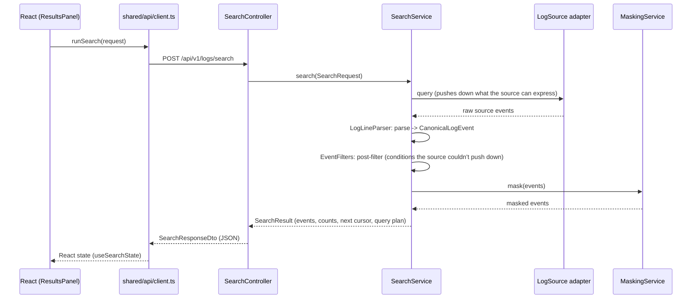
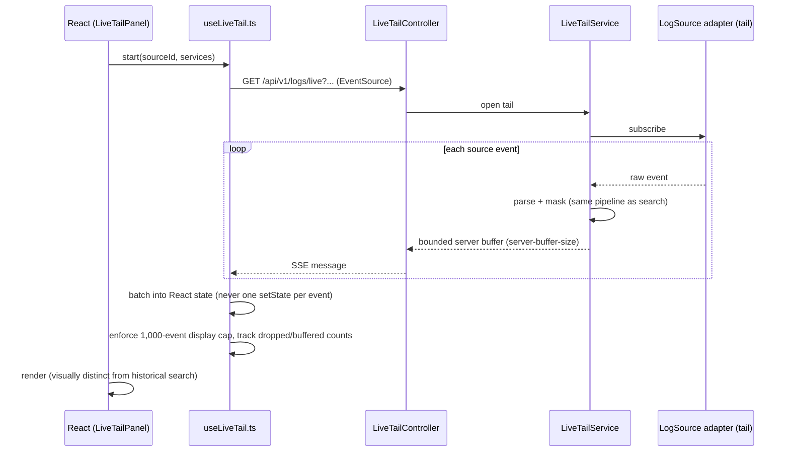

# Backend ↔ Frontend integration

The exact request/response flow for each of the three investigation
workflows, end to end, plus the API surface and cross-cutting mechanics
(pagination cursors, error model, source capabilities) they all share. See
[`ARCHITECTURE.md`](ARCHITECTURE.md) for the system-level picture and
[`backend/README.md`](../../backend/README.md) /
[`frontend/README.md`](../../frontend/README.md) for the code-level
developer guides.

## API surface

| Method | Path | Purpose |
|---|---|---|
| `GET` | `/api/v1/sources` | List configured sources + their capabilities |
| `GET` | `/api/v1/sources/{id}/health` | One source's health/capabilities |
| `GET` | `/api/v1/sources/{id}/services` | Service list for that source (capability-gated) |
| `GET` | `/api/v1/sources/docker/connection` | Effective Docker connection config (non-secret fields only) |
| `POST` | `/api/v1/sources/docker/test-connection` | Test a *candidate* Docker config without applying it |
| `POST` | `/api/v1/logs/search` | Historical search |
| `POST` | `/api/v1/logs/context` | Bounded `±30s` context window around one event |
| `POST` | `/api/v1/logs/journey` | Cross-service timeline for one correlation/trace/journey ID |
| `GET` | `/api/v1/logs/live` | Live tail (SSE, `text/event-stream`) |
| `GET` | `/actuator/health`, `/actuator/info` | Platform health/build-info (also what the Windows launcher and Docker `HEALTHCHECK` poll) |

Frontend call sites for all of these: `frontend/src/shared/api/client.ts`
(the only file that calls `fetch`).

## Historical search

`SearchResponseDto` carries `events`, `counts` (estimated total / returned
/ visible / limit / truncated — all independently honest, never
contradictory), `nextCursor` (opaque, see "Pagination" below), and
`queryPlan` (what was pushed to the source vs. evaluated in-process —
never echoes a raw sensitive filter value, see `QueryPlanLeakTest`).

Every explicit click of **Search** builds a fresh `SearchRequestBody` from
the currently *committed* criteria (time range, severity, services/mode,
advanced filters, tags, query text — see `buildRequestBody` in
`useSearchState.ts`) and sends it as a new `POST`; a superseded/late
response can never overwrite a newer search's results
(`activeRequestRef`/`AbortController`, same file). Draft edits to a filter
field (typing, toggling a checkbox) only ever change local component
state — nothing is re-queried until Search is actually clicked. This is
what makes filtering behave correctly even against a source whose own raw
data changes between searches (PR65_FRESH_SEARCH_CUSTOM_TIME_AND_BATCH_RECOVERY):
a "stuck" result was traced to `DockerLogSource` capping every historical
read at `defaultTailLines` raw lines per container, once, regardless of
how selective the request was — not to a stale/cached frontend request.
See that class's `searchBlocking` javadoc for the fix: a bounded,
per-container progressive scan (`logexplorer.docker.max-historical-scan-chunks`,
default 5 rounds) that narrows a capped container's window to strictly
older territory and re-reads it, independently per container, until every
container's window is provably covered or the round budget runs out. When
the budget runs out first, `SourceSearchOutcome#runtimeWarnings()` carries
a warning and `SearchService` sets `counts.truncated = true` while
withholding a fabricated `estimatedTotal` — the same honest-partial-result
channel `OpenShiftLogSource` already used for its own bounded-scope case.

Both a fresh Search and every "Load more" (`loadMore` in
`useSearchState.ts`) request the same explicit page size,
`DEFAULT_PAGE_SIZE = 500` (`frontend/src/shared/api/pageSize.ts`), which
mirrors the backend's own `logexplorer.search.default-limit` default (also
500, independently enforced/clamped server-side by
`SearchGuardrailsProperties` regardless of what the client sends, up to
the hard `max-limit` of 5000).

## Live

Reconnect is bounded and cancellable on the frontend (`useLiveTail.ts`);
the server enforces `max-concurrent-tails` and a heartbeat interval so a
silently-dead connection is detectable. Neither side ever buffers
unboundedly — see `docs/verification/LEGACY_REMEDIATION_SLICE_5_REPORT.md`
for the original bounded-buffering verification and
`useLiveTail.performance.test.ts`/`ResultsTable.performance.test.tsx` for
the regression tests every later slice re-runs.

## Context / journey

Both reuse the exact same parse → post-filter → mask → DTO pipeline as
historical search — the only difference is how the request is
constructed:

- **Context**: `RequestFlowSection`'s "Show ±30 seconds" (mouse: a
  confirm-then-run popover via `ContextAction.tsx`; the `X` keyboard
  shortcut runs it directly) computes a `±30s` window around the selected
  event's timestamp, optionally scoped to the same service/container/pod,
  and calls `POST /api/v1/logs/context`. The frontend sets a breadcrumb
  (`state.breadcrumbLabel`) so "Back to original search" can restore the
  prior results — this breadcrumb is frontend-only state, never sent back
  to the server.
- **Journey**: clicking a non-sensitive trace/correlation/journey ID calls
  `POST /api/v1/logs/journey` with that ID. The resulting events are
  rendered in ascending chronological order (`JourneyView.tsx`) with an
  explicit "this does not indicate causality" disclaimer — ordering is a
  presentation choice, not a claim the backend makes about causation.
  Gap-between-events detection (`frontend/src/features/results/
  gapDetection.ts`) is likewise entirely frontend-computed from the
  already-returned event list; there is no backend "gap" concept.

## Pagination / cursors

`nextCursor` in `SearchResponseDto` is an opaque, **HMAC-signed** string
(`PageCursorCodec`/`PageCursorPayload`, `backend/core/search/`) — never a
raw offset, never raw query text. The frontend never inspects or
constructs a cursor; it only ever sends back exactly what it received
(`loadMore` in `useSearchState.ts`). A cursor signed for one query is
rejected if replayed against a different one — see
`SearchServicePaginationTest`/`CursorLeakTest`.

## Timestamps and correlation precedence

- Every timestamp on the wire is UTC ISO-8601; the frontend converts to
  the display zone exactly once, at render time
  (`frontend/src/features/inspector/timestampFormat.ts`) — never
  round-tripped through a second conversion.
- Correlation ID precedence (parsed once, backend-side, never
  re-derived client-side): `mdc.X-Correlation-id` first, then the
  **literal** key `mdc["event.correlationId"]` (a key containing a dot,
  not a nested path) — see `LogLineParser`'s own doc comment.

## Error model

Every error response is an RFC 7807 `ProblemDetail`
(`GlobalExceptionHandler`, backend) — `type`/`title`/`status`/`detail`,
never a raw stack trace, never a raw sensitive value or query text (see
`QueryPlanLeakTest`/`LogLeakTest`). The frontend surfaces `detail` directly
in its error states (e.g. `ResultsPanel`'s error banner) — there is no
client-side error-message translation layer to keep in sync.

## Source capability flow

`SourceCapabilities` (`historicalSearch`, `liveTail`, `rawLogQL`,
`serviceDiscovery`, `queryStatistics`, `contextView`) is computed
backend-side from real configuration/connectivity and returned on every
`GET /api/v1/sources`/`.../health` call. The frontend treats this as the
single source of truth — it never infers a capability from the source's
`id`/type, and never shows a control (Live button, raw LogQL toggle, …)
for a capability a source doesn't report as `true`. If you add a new
capability-gated feature, it must be threaded through
`SourceCapabilities` on the backend before the frontend can safely gate
on it — gating on source id/type instead is exactly the anti-pattern this
flow exists to prevent.
