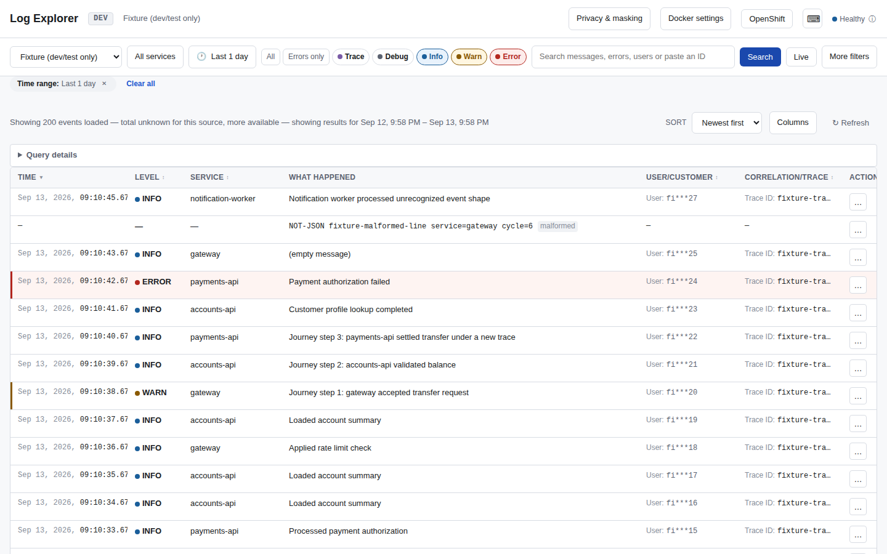
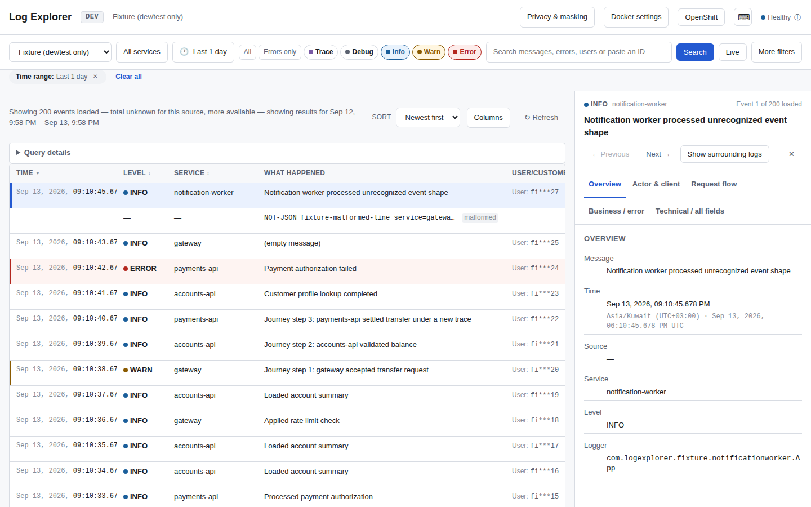
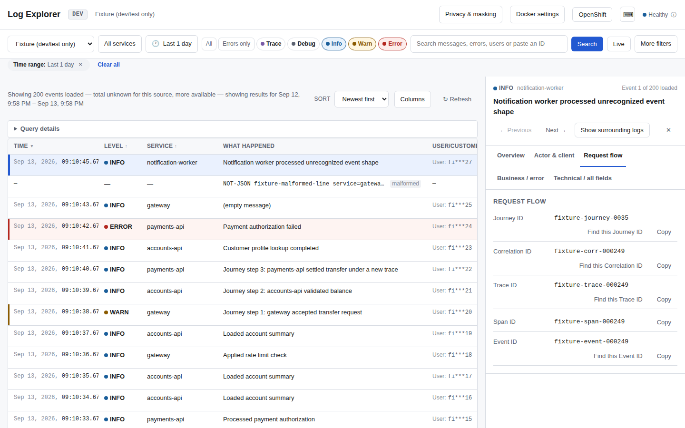
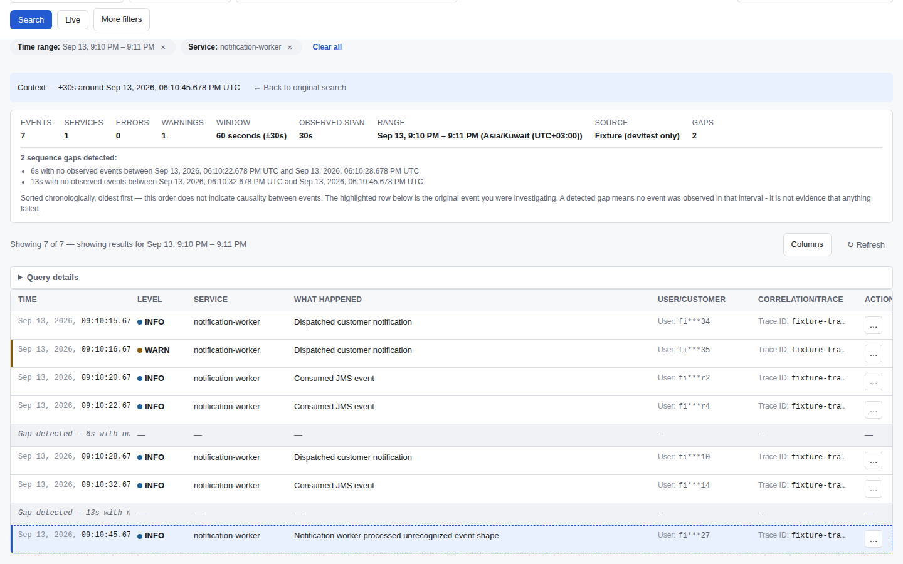
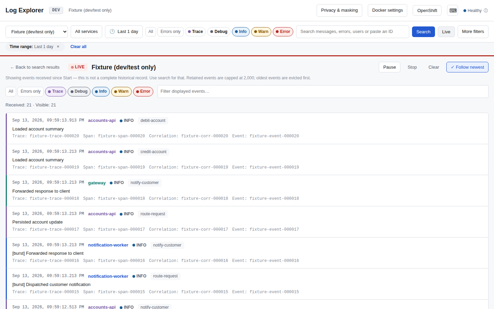
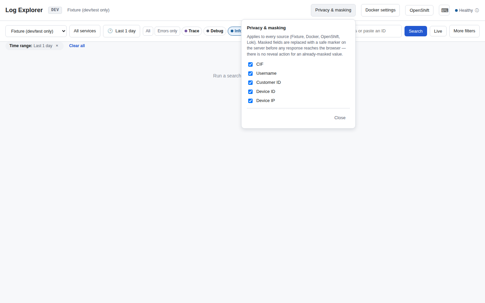

# Log Explorer — دليل المستخدم

يشرح هذا الدليل كيفية استخدام Log Explorer لفحص سجلات التطبيقات
(logs) دون الحاجة لمعرفة أي شيء عن كيفية بناء التطبيق من الداخل — فقط
ما تراه أمامك على الشاشة.

جديد على Log Explorer؟ ابدأ بـ **[QUICK_START_AR.md](QUICK_START_AR.md)**
وهو دليل سريع مدته 10 دقائق. هذا الدليل يتوسّع في شرح كل جزء بالتفصيل.

**أدلة أخرى في هذا المجلد:**
- [QUICK_START_AR.md](QUICK_START_AR.md) — أسرع طريقة للبدء
- [TROUBLESHOOTING_AR.md](TROUBLESHOOTING_AR.md) — الأعراض وأسبابها وحلولها
- [CAPABILITY_MATRIX.md](CAPABILITY_MATRIX.md) — ما يدعمه كل مصدر بيانات وما لا يدعمه (بالإنجليزية)
- النسخة الإنجليزية: `USER_GUIDE_EN.md`, `QUICK_START_EN.md`, `TROUBLESHOOTING_EN.md`

---

## 1. ما الغرض من Log Explorer

يساعدك Log Explorer على الإجابة عن أربعة أسئلة حول أي حدث وقع في
تطبيقك:

- **من (WHO)** كان مسؤولًا عن الحدث أو مرتبطًا به؟ (مستخدم، عميل، جهاز)
- **ماذا (WHAT)** حدث بالضبط؟ (الرسالة، الخطأ، الخطوة التجارية)
- **لماذا (WHY)** حدث ذلك؟ (تفاصيل الخطأ، أحداث مرتبطة، مسار الطلب)
- **أين (WHERE)** وقع الحدث؟ (أي خدمة، أي حاوية/Container، أي بيئة)

يقرأ Log Explorer السجلات من **مصدر واحد** في كل مرة — إعداد Docker
محلي، أو خادم Docker بعيد، أو عنقود OpenShift (مباشرة، أو عبر Loki) —
ويمنحك طريقة واحدة موحّدة للبحث والفحص والمتابعة الحيّة، أيًا كان
مصدر البيانات.

---

## 2. الشاشة الرئيسية بنظرة سريعة

في أعلى الشاشة:

- **Source** — قائمة منسدلة لاختيار مصدر البيانات (انظر §4).
- **Time range** — زر يفتح قائمة بفترات زمنية جاهزة (مثل "Last 1 day")،
  أو يمكنك تحديد بداية ونهاية مخصّصة بنفسك.
- أزرار سريعة لمستوى الخطورة (**All**، **Errors only**) ومفتاح لإظهار
  مستويي **Trace/Debug** المخفيّين افتراضيًا لكثرة تفاصيلهما.
- **More filters** — يفتح لوحة فيها بقية عوامل التصفية، مجمّعة حسب
  السؤال الذي تجيب عنه (انظر §9).
- **Search** — ينفّذ البحث بكل الإعدادات الحالية.
- **Live** — يبدأ بثّ الأحداث الجديدة فور حدوثها (يظهر فقط إذا كان
  المصدر المختار يدعم هذه الميزة).

في الزاوية العلوية اليمنى:

- **Privacy & masking** — إعداد عام لا يرتبط بمصدر بيانات معيّن (§16).
- **Docker settings** / **OpenShift** — إعدادات خاصة بمصدر بيانات محدّد (§17).
- زر لعرض اختصارات لوحة المفاتيح، ومؤشّر لحالة (health) المصدر.

أسفل ذلك: عوامل التصفية النشطة معروضة كـ"شرائح" (chips) يمكن حذف كل
واحدة منها بشكل منفصل، ثم جدول النتائج الذي يشغل معظم الشاشة.



*ملاحظة حول لقطات الشاشة: كل لقطة شاشة في هذا الدليل مُلتقَطة من مصدر
Fixture المُضمَّن (بيانات تجريبية آمنة وغير حقيقية تمامًا) عند خط الأساس
الوظيفي الحالي. توثّق هذه اللقطات كيفية عمل التطبيق اليوم فقط — وهي
**ليست** الهدف البصري لإعادة التصميم القادمة.*

---

## 3. نظرة عامة على مصادر البيانات

| المصدر | ما هو | متى تستخدمه |
|---|---|---|
| **Fixture** | مجموعة أحداث تجريبية ثابتة ومُضمّنة داخل التطبيق، غير متصلة بأي نظام حقيقي. | لتجربة Log Explorer أو التأكد من أنه يعمل، دون أي نظام حقيقي. |
| **Docker** | يقرأ سجلات الحاويات من محرّك Docker — محليًا أو عن بُعد. | لفحص خدمة تعمل عبر Docker Compose أو على خادم Docker عادي. |
| **OpenShift** | يقرأ سجلات الـ pods مباشرة من واجهة برمجة تطبيقات عنقود OpenShift/Kubernetes. | لفحص خدمة تعمل على OpenShift، وهو المصدر الأغنى بالإمكانيات (المتابعة الحيّة، السياق، الربط). |
| **OpenShift Loki** | يقرأ سجلات نفس العنقود عبر بوّابة Loki بدلًا من واجهة سجلات الـ pods. | عرض بديل لسجلات OpenShift عند وجود LokiStack منشور. إمكانياته حاليًا أقل من OpenShift المباشر (انظر [مصفوفة الإمكانيات](CAPABILITY_MATRIX.md)). |

لا يدعم كل مصدر كل الميزات — يعرض Log Explorer عنصر التحكّم (المتابعة
الحيّة، السياق، الربط، الاستعلام الخام) فقط عندما يعلن المصدر الحالي
فعليًا دعمه له. فإن لم تجد زرًا معيّنًا، فهذا يعني أن المصدر لا يقدّم
هذه الميزة — لا شيء يُخفى بشكل اعتباطي.

التفاصيل الكاملة لكل مصدر: §4 (Docker)، §5 (OpenShift)، §6 (Loki).

---

## 4. Docker — الاتصال والاستخدام

### Docker محلي (Local)

إن كان Log Explorer يعمل على نفس الجهاز الذي يعمل عليه محرّك Docker،
فاختر **Docker** كمصدر بيانات — لا حاجة لأي إعداد إضافي. يقرأ Log
Explorer معلومات الحاويات وسجلاتها فقط؛ لا يبدأ أو يوقف أو يغيّر أي شيء
في Docker إطلاقًا.

### Docker عن بُعد (Remote)

اضغط **Docker settings** في الزاوية العلوية اليمنى:

1. اضبط **Mode** على **Remote**.
2. أدخل **Host** (عنوان الجهاز البعيد).
3. **Port** تكون افتراضيًا `2375`. غيّره فقط إن كان محرّك Docker
   لديك يستمع على منفذ مختلف.
4. فعّل **Use TLS** فقط إن كان محرّك Docker البعيد يتطلّب ذلك، وحدّد
   **Certificate directory path** على الجهاز الذي يعمل عليه الخادم
   الخلفي (backend) لـ Log Explorer. التحقّق من شهادات TLS يتم دائمًا
   بالكامل عند تفعيله — لا توجد وسيلة لتعطيل التحقّق مع بقاء TLS
   مفعّلًا.
5. اضغط **Test Connection** للتأكّد قبل الاعتماد عليه.

**لست مضطرًا** لفتح منفذ Docker الخاص بك على الشبكة لمجرّد استخدام Log
Explorer في إعداد محلي — وضع "عن بُعد" مطلوب فقط عندما يعمل Log
Explorer نفسه على جهاز مختلف عن جهاز Docker.

### مشاريع Compose والخدمات والحاويات

بمجرّد الاتصال، يكتشف Log Explorer تلقائيًا أي مشاريع Docker Compose
يستطيع رؤيتها. اختيار أحدها يحصر بحثك في حاويات ذلك المشروع فقط. يمكنك
التضييق أكثر عبر الخدمة (service) من داخل لوحة **More filters**. يمكن
قراءة سجلات الحاويات العاملة والمتوقّفة على السواء، طالما ما زالت
موجودة لدى Docker نفسه.

### أخطاء Docker الشائعة

راجع [TROUBLESHOOTING_AR.md](TROUBLESHOOTING_AR.md) للاطّلاع على حالات
"تعذّر الوصول إلى Docker" و"منفذ Docker البعيد محجوب" و"فشل TLS في
Docker البعيد."

---

## 5. OpenShift — الاتصال والاستخدام

اضغط **OpenShift** في الزاوية العلوية اليمنى. ستظهر لك استمارة تطلب
**Connection name** (اختياري، مجرّد تسمية توضيحية لك) ومكانًا للصق أمر
`oc login`.

**مهم:** يقرأ Log Explorer القيم `--server` و`--token`
و`--certificate-authority` من الأمر الذي تلصقه فقط — لا **يشغّل** أداة
`oc` أبدًا، ولا يحتاج إلى تثبيتها أصلًا. الصق بالضبط ما طبعته لك `oc
login` (أو ما كنت ستكتبه لتشغيلها)، مثلًا:

```
oc login --token=sha256~xxxxxxxx --server=https://api.example.com:6443
```

يُحفظ الرمز (token) في الذاكرة فقط لهذه الجلسة. لا يُكتب أبدًا على
القرص، ولا يُعرض مرة أخرى بعد إرساله، ولا يظهر في أي شاشة يمكنك النسخ
منها.

### إعدادات الوكيل (Proxy)

إن كانت شبكتك تتطلّب خادم وكيل (proxy) للوصول إلى العنقود، تحتوي نفس
لوحة **OpenShift** على قسم **Proxy** بثلاثة خيارات:

- **Use system proxy** (الخيار الافتراضي) — يستخدم متغيّرات بيئة
  جهازك `HTTPS_PROXY` و`HTTP_PROXY` و`NO_PROXY`، تمامًا كما تفعل أدوات
  سطر الأوامر مثل `oc` أو `curl`.
- **Direct connection** — لا يستخدم أي وكيل إطلاقًا، حتى لو كان معرّفًا
  على جهازك.
- **Custom proxy** — أدخل **Proxy server** و**Proxy port** مباشرة داخل
  Log Explorer. هذا الخيار لا يعتمد على أي متغيّر بيئة، لذا يعمل
  بنفس الطريقة أيًا كانت طريقة تشغيلك لـ Log Explorer (من قائمة ابدأ،
  أو من تطبيق macOS، أو من الطرفية).

أيًا كان الوضع الذي تختاره، يُطبَّق بشكل متّسق على كل من واجهة OpenShift
المباشرة وOpenShift Loki معًا — لن يحدث أبدًا أن يمرّ أحدهما عبر وكيل
بينما لا يمرّ الآخر.

لا تلصق رمزك (token) أبدًا في حقل الوكيل، أو في رابط، أو في أي مكان
غير مربّع `oc login` — لا فائدة لـ Log Explorer منه هناك ولن يكون
محميًا.

### المشروع، الحِمل، الـ Pod، الحاوية

بعد الاتصال، اختر **Project** (أو **Namespace** إن كان عنقودك يعرض هذا
المصطلح فقط). تحته يمكنك التضييق اختياريًا أكثر:

- **Workload** — حِمل عمل محدّد (Deployment/DeploymentConfig/StatefulSet/
  DaemonSet)، أو **All workloads** للبحث في كل شيء داخل المشروع.
- **Pod** — pod محدّد، أو **All matching pods**.
- **Container** — حاوية محدّدة بعد اختيار pod، أو **All applicable
  containers**.

ترك مستوى ما عند "الكل" أمر طبيعي وغالبًا هو ما تريده — فهذا يبحث في
كل نسخ (replicas) الحِمل مثلًا، وهو مفيد عندما لا تعرف بعد أي pod
تحديدًا هو المعني.

### البحث، الفاحص، السياق، الربط، المتابعة الحيّة

بعد اختيار مشروع (وتضييق النطاق اختياريًا)، يعمل البحث والفاحص (Inspector)
وإظهار المحيط ("Show Surroundings") ومساحة عمل التحقيق والمتابعة الحيّة
تمامًا كما هو موصوف في أقسامها الخاصة أدناه (§9، §12–§17، §19) — OpenShift
هو المصدر الأغنى بمجموعة الإمكانيات الكاملة.

**أثناء تحديث متجدّد (rolling update):** إذا كان الحِمل قيد إعادة نشر
أثناء استخدامك للمتابعة الحيّة، يواصل Log Explorer متابعة نفس الـ pods
التي بدأ بها بدلًا من التبديل بصمت إلى pods جديدة في منتصف تحقيقك —
وإن توقّفت تلك الـ pods، يخبرك بوضوح بدلًا من التظاهر بأن شيئًا لم
يتغيّر.

---

## 6. OpenShift Loki

يقرأ Loki سجلات نفس العنقود، لكن عبر بوّابة Loki بدلًا من واجهة سجلات
الـ pods المباشرة. اختر مصدر **OpenShift Loki** بنفس طريقة اختيار أي
مصدر آخر.

**انتبه للفروقات عن OpenShift المباشر:**

- لا يوجد محدّد نطاق Project → Workload → Pod → Container — بحث Loki
  يُحدَّد نطاقه عبر عوامل تصفية بالتصنيفات (labels) بدلًا من ذلك.
- لا توجد حاليًا متابعة حيّة (Live) ولا عرض سياق "Show Surroundings".
- قد يتوفّر وضع **Raw query** إذا فعّله مسؤول نظامك، يتيح لك كتابة
  استعلام LogQL مباشرة — وهذا اختياري تمامًا ومعطّل افتراضيًا.

راجع [مصفوفة الإمكانيات](CAPABILITY_MATRIX.md) للمقارنة الدقيقة
والحالية سطرًا بسطر — لا يوحي Log Explorer أبدًا بأن Loki يدعم شيئًا
لا يدعمه فعلًا.

**الصدق حول التحقّق الفعلي:** منطق الوكيل والاتصال الخاص بـ Loki
مُنفَّذ ومُختبَر بنفس أسلوب OpenShift، لكن تشغيله فعليًا مقابل بوّابة
Loki حقيقية لم يكن ممكنًا في بيئة التطوير والاختبار الخاصة بهذا
المشروع (لم تتوفّر نسخة Loki حقيقية يمكن الوصول إليها). إن لاحظت
سلوكًا مختلفًا عن المتوقّع مع بوّابة Loki الخاصة بك، فهذا هو السبب
الأرجح — يُرجى الإبلاغ عنه.

---

## 7. مصدر Fixture

**Fixture** هو مجموعة أحداث سجلات تجريبية آمنة ومستقلّة تمامًا
ومُضمّنة داخل Log Explorer، ولا تتطلّب أي اتصال بأي نظام. استخدمه
لتعلّم الأداة، أو للتأكد من أن Log Explorer نفسه يعمل، قبل الاتصال
بنظام حقيقي.

---

## 8. النطاق الزمني (Time range)

اضغط زر النطاق الزمني لفتح قائمة بفترات جاهزة: **Last 15 minutes,
Last 30 minutes, Last 1 hour, Last 4 hours, Last 1 day, Last 7 days**،
أو **Custom** (مخصّص).

اختيار **Custom** يفتح نافذة صغيرة بحقلي **Start** و**End**، وزرّي
**Apply** و**Cancel**. تطفو هذه النافذة فوق شريط الأدوات كطبقة مثبّتة
الموضع — فتحها أو إغلاقها لا يحرّك ولا يغيّر حجم أي عنصر تحكّم آخر في
شريط الأدوات (المصدر، الخدمة، الخطورة، البحث، زر Search، والمتابعة
الحيّة تبقى جميعها في مكانها تمامًا). يؤكّد **Apply** النطاق ويعرض لك
بالضبط أي تواريخ/أوقات والمنطقة الزمنية أصبحت مفعّلة الآن — لا يعرض
أبدًا تسمية غامضة مثل "نطاق مخصّص." يغلق **Cancel**، أو ضغط مفتاح
Escape، أو النقر خارج النافذة دون تغيير أي شيء.

إن أعاد البحث صفر نتائج، يعرض Log Explorer اختصارًا بضغطة واحدة
**"Search last 1 day"** بدلًا من تركك حائرًا.

---

## 9. البحث وعوامل التصفية

تغيير أي عامل تصفية — الكتابة في حقل، تفعيل مربّع اختيار، اختيار
خدمة — لا يعدّل سوى معايير التصفية *المسوّدة* الخاصة بك؛ لا يُرسَل شيء
إلى المصدر حتى تضغط فعليًا زر **Search** (أو تضغط Enter داخل مربّع
البحث). لا يوجد بحث تلقائي أثناء الكتابة. كل ضغطة على **Search** تُعيد
تشغيل الاستعلام على المصدر المحدّد من الصفر، بكامل معاييرك الحالية
(النطاق الزمني، الخطورة، الخدمات، عوامل التصفية المتقدّمة، الوسوم، نص
الاستعلام) — وهو أبدًا ليس تصفيةً تُطبَّق فقط على الصفحة التي كانت
محمَّلة مسبقًا، لذا إن كان هناك حدث مطابق أبعد في تاريخ المصدر نفسه لكنه
لا يزال داخل نطاقك الزمني، يمكن لبحث جديد أن يجده حتى لو لم تتضمّنه
نتائج بحث سابق أوسع.

### الأحدث / الأقدم (Newest / Oldest)

مفتاح بجانب عناصر التحكّم بالنتائج يحدّد ما إذا كانت الأحداث الأحدث أم
الأقدم تُحمَّل أولًا. هذا هو نفس الإعداد الذي يستخدمه زر الفرز الخاص
بعمود Time (انظر §11) — يوجد دائمًا اتجاه فرز واحد نشط، لا يتعارض
أبدًا عنصرا تحكّم مختلفان.

### عوامل التصفية السريعة (ظاهرة دائمًا)

- **Service** — اختر خدمة أو تطبيقًا واحدًا أو أكثر.
- **Severity** — **All** أو **Errors only**، بالإضافة إلى مفتاح منفصل
  لإظهار مستويي **Trace/Debug** الأكثر تفصيلًا (مخفيّان افتراضيًا).
- مربّع البحث — نص حرّ، ويتعرّف أيضًا عندما تلصق فيه شيئًا يشبه معرّفًا
  معروفًا (مثل trace ID أو correlation ID) ويقترح عليك البحث بذلك الحقل
  تحديدًا.

### More filters (اللوحة الموسّعة)

تفتح مجموعة حقول مُجمَّعة حسب السؤال الذي تجيب عنه:

**من / العميل (Who / customer)** (حقول محميّة — التقنيع قابل للتهيئة لكل حقل، انظر §15)
- User name، Customer ID، CIF، Device ID، Device IP

**مسار الطلب (Request flow)**
- Trace ID، Span ID، Correlation ID، Journey ID، Event ID

**ماذا حدث (What happened)**
- Error code، Business step، UI identifier، Logger/class contains، Message contains

**سياق العميل (Client context)**
- Device platform، Language

كل حقل موسوم بنوع المطابقة التي يستخدمها — **exact** (مطابقة تامّة
للقيمة) أو **contains** (مطابقة جزئية)، فتعرف دائمًا نوع البحث الذي
تجريه.

### مثال عملي

للبحث عن كل ما يتعلّق بعملية دفع فاشلة، يمكنك: ضبط **Severity** على
Errors only، فتح **More filters**، وإدخال **Trace ID** الذي لديك
مسبقًا من تذكرة دعم فنّي — أو إن لم يكن لديك واحد بعد، ابحث أولًا عبر
**Message contains** عن `payment failed`، ثم افتح إحدى النتائج
واحصل على Trace ID من فاحصها (Inspector، §15) لتوسيع بحثك انطلاقًا منه.

### الاستعلام المتقدّم وRaw LogQL

يتوفّر منشئ استعلام متقدّم لدمج شروط تتجاوز ما تتيحه عوامل التصفية
السريعة/اللوحة. أمّا **Raw LogQL** (كتابة استعلام Loki الأصلي مباشرة)
فيُعرض فقط لمصدر OpenShift Loki، وفقط إذا فعّله مسؤول نظامك، ويظل
دائمًا محدودًا — لا يُستخدم أبدًا كوسيلة لتشغيل استعلام غير مقيَّد.

---

## 10. جدول النتائج

كل صفّ هو حدث سجل واحد. الأعمدة الافتراضية:

| العمود | المعنى |
|---|---|
| Time | وقت وقوع الحدث (تاريخ، وقت، ميلي ثانية) |
| Level | مستوى الخطورة (Trace/Debug/Info/Warn/Error) |
| Service | الخدمة/التطبيق الذي أنتج الحدث |
| What happened | رسالة السجل |
| Tags | وسوم التصنيف التي طابقتها قاعدة محفوظة لهذا الحدث (انظر "قواعد تصنيف الأحداث" أدناه)، تُعرض كشريحة واحدة مع عدّاد "+n" عند وجود أكثر من وسم |
| User/Customer | من كان معنيًّا (مُقنَّع أو لا، حسب إعدادات Privacy & masking الحالية — انظر §15) |
| Correlation/Trace | معرّف مسار الطلب، إن وُجد |
| Actions | قائمة "…" بإجراءات على مستوى الصفّ |

القيمة المفقودة تُعرض دائمًا كـ `—` — لا تُترَك أي خلية فارغة، فتستطيع
دائمًا التمييز بين "لا قيمة" و"لم يُحمَّل بعد."

### الفرز (Sorting)

اضغط أي عنوان عمود قابل للفرز للفرز بحسبه: النقرة الأولى تفرز تصاعديًا،
والثانية تنازليًا، ويُظهر العنوان سهمًا يخبرك دائمًا باتجاه الفرز
الحالي. النقر على عنوان **Time** هو نفس إجراء مفتاح الأحدث/الأقدم
(§9) — لا يحدث أبدًا فرز ثانٍ مختلف بصمت تحته.

### اختيار وإعادة ترتيب الأعمدة

اضغط **Columns** لفتح لوحة تستطيع فيها:
- تفعيل أو إلغاء تفعيل أي عمود لإظهاره/إخفائه.
- **سحب صفّ باستخدام مقبضه (⠿)** لإعادة ترتيب الأعمدة، أو استخدام
  زرّي **Move up/Move down** إن كنت تفضّل لوحة المفاتيح.
- التبديل بين كثافة **Comfortable** و**Compact**.
- الضغط على **Reset table** للعودة إلى الأعمدة السبعة الافتراضية،
  بترتيبها وكثافتها الأصليّين.

تغيير أحد هذه الإعدادات (إعادة الترتيب، الكثافة، الفرز) لا يُعيد
ضبط الإعدادات الأخرى أبدًا — فهي مستقلّة، ويتذكّر Log Explorer
اختياراتك في المرة القادمة التي تفتحه فيها.

### اختيار صفّ، وLoad More

اضغط أي صفّ (أو اضغط Enter على صفّ محدَّد) لفتحه في الفاحص (§15). يبقى
الصفّ المختار مميَّزًا بصريًا حتى بعد تغيير حجم الأعمدة أو الكثافة أو
تحميل المزيد من النتائج.

يحمّل Log Explorer حتى 500 حدث مطابق في كل صفحة افتراضيًا (يمكن لمسؤول
النظام تغيير هذا الحدّ)، ويطلب **Load More** نفس حجم الصفحة مجدّدًا —
وتبقى حالة الأعمدة/الفرز/الاختيار كما هي عبر ذلك. "500" تعني دائمًا 500
حدثًا طابق فعليًا عوامل تصفيتك، وليست أبدًا 500 سطر سجلّ خام ناقصًا ما
تمّت تصفيته.

### إذا كانت النتائج مقصوصة

إذا تجاوز البحث حدوده — وجود مطابقات أكثر ممّا تتّسع له صفحة واحدة، أو
(لمصدر Docker تحديدًا) تعذّر فحص كامل تاريخ حاوية مزدحمة جدًا ضمن الجهد
المحدود الذي يبذله بحث Log Explorer — يخبرك Log Explorer بوضوح أن
النتائج جزئية بدلًا من القصّ الصامت أو ادّعاء إجمالي دقيق لا يملك دليلًا
عليه. ضيّق نطاقك الزمني أو عوامل التصفية، أو استخدم **Load More**، لرؤية
المزيد.

---

## 11. فاحص الحدث (Event Inspector)

اضغط أي صفّ لفتح الفاحص. خمسة تبويبات موجودة دائمًا، لكل حدث، بهذا
الترتيب:

1. **Overview** — الحقائق الأساسية: الرسالة، الوقت، المصدر، الخدمة،
   المستوى، الـ logger. عندما يحمل الحدث معلومات خطأ حقيقية (انظر
   أدناه)، يظهر قرب الأعلى قسم **Error summary** — الخطورة، رمز الخطأ،
   نوع الاستثناء إن أمكن تحديده، ومعاينة قصيرة وقابلة للقراءة لرسالة
   الاستثناء — مع زرّ **View full error details** ينقلك مباشرةً إلى
   تبويب Error. الحدث غير الخاطئ لا يُظهر أي ملخّص خطأ إطلاقًا؛ لا يدّعي
   Log Explorer أبدًا فشل حدث ما ما لم تُثبت البيانات ذلك فعليًا.
2. **Actor & client** — من/ما كان معنيًّا (الحقول المُقنَّعة، الجهاز،
   اللغة).
3. **Request flow** — معرّفات Trace/Span/Correlation/Journey/Event، كل
   منها بزرّ نسخ، وإجراء تحقيق حيث يتوفّر المعرّف (§13): **View
   Trace**، أو **View Span**، أو **Find same Correlation**، أو
   **Find same Journey**، أو **Find same Event**.
4. **Business** — الخطوة التجارية ومعرّف واجهة المستخدم فقط. لا يخلط
   أبدًا بيانات الخطأ أو الاستثناء فيه.
5. **Technical / all fields** — كل حقل يحمله الحدث، بما فيها الحقول
   التي لا يتعرّف عليها Log Explorer تحديدًا. مربّع بحث يتيح تصفية
   قائمة طويلة من الحقول. قسمان منفصلان تحتها يعرضان السجل الأساسي
   بطريقتين مختلفتين: **Canonical Event JSON** هو تمثيل Log Explorer
   المُحلَّل والمُطبَّع للحدث، بينما **Raw source JSON (masked)** هو
   السطر الحقيقي الذي أرسله المصدر فعليًا دون تغيير — بأسماء الحقول
   الحقيقية وأي حقل إضافي أو غير متوقّع لم تتعرّف عليه قاعدة الربط
   بعد، مع تقنيع الحقول الخمسة المحمية (CIF، اسم المستخدم، معرّف
   العميل، معرّف الجهاز، عنوان IP الجهاز) بنفس الطريقة المستخدمة في
   كل مكان آخر. استخدمه لتحديد مشكلة في ربط الحقول (مسار خاطئ، حقل
   ناقص، شكل غير متوقّع) مباشرةً مقابل البيانات الحقيقية، دون الحاجة
   إلى سير عمل Log Schema & Field Mapping المنفصل (§19) — فعيّنة
   "Original Source JSON" الخاصة بذلك السير غير مُقنَّعة عمدًا، لأنها
   مخصّصة لمهمة مختلفة ومُقيَّدة الصلاحية، وهي إعداد قواعد الربط من
   الأساس.

تبويب سادس، **Error**، يظهر فقط للحدث الذي يحمل فعليًا معلومات خطأ —
مستوى خطورة ERROR أو FATAL، أو استثناء حقيقي، أو رمز خطأ حقيقي. يعرض
رمز الخطأ، ونوع/فئة الاستثناء إن أمكن تحديدها، ورسالة الاستثناء،
والاستثناء/تتبّع المكدّس (stack trace) الكامل، محفوظًا بفواصل أسطره
الأصلية في كتلة نصّ أحادي المسافة (monospace) قابلة للقراءة — لا يُضغط
أبدًا في سطر واحد ولا يُقصَّ — مع زرّ **Copy** خاصّ به. إن كانت الخطورة
ERROR/FATAL لكن الحدث لا يحمل استثناءً أو رمز خطأ، يقول التبويب ذلك
بوضوح بدل اختلاق تتبّع وهمي. تبويب Error هو الاستثناء المتعمَّد الوحيد
من قاعدة "كل تبويب موجود دائمًا": إظهاره لحدث لا يقول شيئًا عن خطأ ما
سيكون تبويبًا فارغًا بلا فائدة تشخيصية، لا تبويبًا فارغًا وصادقًا.

**التبويبات الخمسة الأخرى موجودة دائمًا، لكل حدث — وهذا مقصود.** إن لم
تكن لحدث ما فعليًا أي بيانات عن الفاعل/العميل، يظل ذلك التبويب ظاهرًا
ويقول ذلك بوضوح (مثل "No actor or client data on this event") بدلًا
من أن يختفي. فاختفاء تبويب قد يعني "هذه الفئة لا تنطبق هنا" أو "الواجهة
أخفت شيئًا" — ولا يترك Log Explorer لك التخمين أبدًا. الحقول غير
المعروفة أو المخصّصة لا تُحذَف أبدًا؛ تبقى دائمًا ظاهرة في تبويب
Technical / all fields.

استخدم **Previous**/**Next** (أو مفتاحي `[`/`]`) للتنقّل بين النتائج
المحمّلة حاليًا دون إغلاق الفاحص. اختيار حدث مختلف يعيدك دائمًا إلى
تبويب Overview — بما في ذلك عندما لا يكون تبويب Error الذي كنت تعرضه
موجودًا أصلًا للحدث المختار حديثًا.




**ما لن يفعله الفاحص:** لن يخمّن أبدًا سببًا لا يستطيع إثباته من
البيانات. إن لم يكن السبب الجذري لخطأ ما موجودًا في حدث السجل نفسه،
يعرض الفاحص لك الأدلة الموجودة فعلًا (الاستثناء، المعرّفات المرتبطة)
بدلًا من اختلاق تفسير.

---

## 12. إظهار المحيط (Show Surroundings)

من حدث مفتوح، اضغط **Show Surroundings** في رأس الفاحص (يظهر بنفس
الشكل ويفعل نفس الشيء من قائمة إجراءات صفّ نتيجة، ومن داخل جدول تحقيق
زمني — راجع §13). يعرض النافذة الزمنية الدقيقة ±30 ثانية قبل وبعد ذلك
الحدث، من **نفس سياق التنفيذ** — نفس الحاوية أو الـ pod أو النطاق
المكافئ الذي جاء منه الحدث الأصلي، ولا يتوسّع أبدًا بصمت ليشمل pod أو
خدمة أخرى.

- الحدث الذي بدأت منه مُميَّز بوضوح — تظليل بصري، تسمية، ويُمرَّر إليه
  تلقائيًا — فلا تفقد أبدًا تتبّع الحدث الذي كنت تنظر إليه أصلًا.
- تُعرض الأحداث بترتيب زمني حقيقي، بغضّ النظر عن إعداد الأحدث/الأقدم
  الذي كان مفعّلًا في بحثك الرئيسي.
- إذا كانت النافذة متوفّرة جزئيًا فقط (مثلًا كنت تنظر إلى أوّل أو آخر
  حدث في التدفّق)، يقول Log Explorer ذلك بوضوح بدلًا من التظاهر بأن
  السياق كامل.
- إجراء **رجوع** يعيدك إلى حيث فتحته فعليًا — نتائجك الأصلية إن بدأت
  من البحث، أو نفس جدول التحقيق الزمني (Trace/Span/Correlation/Journey)
  إن بدأت من داخله، تمامًا كما تركته.



**هذا ليس نفس متابعة طلب واحد** — إظهار المحيط يجيب عن "ماذا حدث تحديدًا
حول هذا الحدث الواحد، في هذا المكان بالذات،" بينما مساحة عمل التحقيق
(§13) تجيب عن "ما الأحداث الأخرى، في أي مكان، التي تشارك هذا الطلب."
استخدم إظهار المحيط عندما تريد سياقًا محليًا ضيّقًا؛ واستخدم مساحة عمل
التحقيق عندما تتابع طلبًا واحدًا عبر نظامك بأكمله.

---

## 13. مساحة عمل التحقيق — متابعة طلب واحد

يحمل كثير من الأحداث واحدًا أو أكثر من: **Trace ID**، أو **Span ID**،
أو **Correlation ID**، أو **Journey ID**، أو **Event ID** — معرّفات
مصمَّمة لربط الأحداث المتعلّقة ببعضها، حتى عبر خدمات مختلفة. فتح أيٍّ
منها يستبدل جدول نتائجك بـ **مساحة عمل تحقيق** مخصّصة: سطح مختلف تمامًا
عن البحث/النتائج (الذي يجد الأحداث) والفاحص (الذي يشرح حدثًا واحدًا) —
هذا السطح موجود لتحقيق العلاقات والسياق عبر أحداث متعدّدة.

مسار عملي:

1. افتح حدثًا في الفاحص وانتقل إلى **Request flow**.
2. اضغط أيّ إجراء تحقيق مُتاح للمعرّف الذي تريد متابعته: **View
   Trace**، أو **View Span**، أو **Find same Correlation**، أو **Find
   same Journey**، أو **Find same Event**. (تتوفّر نفس الإجراءات أيضًا
   مباشرةً من عمود Correlation/Trace في جدول النتائج، لأكثر حالتين
   شيوعًا.)
3. يخبرك الجدول الزمني الذي يُفتح، منذ البداية، بعدد الأحداث التي وجدها
   و**موضع الحدث الذي بدأت منه** بوضوح (مثل "Selected event: 4 of 12")،
   فلا تفقد أبدًا مكانك. إن لم يكن حدثك الأصلي موجودًا فعليًا ضمن النتيجة
   المُعادة (للبحث المحدود حدوده)، يقول Log Explorer ذلك بصدق بدلًا من
   تمييز حدث آخر بدلًا منه.
4. اقرأ الجدول الزمني بترتيبه لترى التسلسل: أي خدمة تحرّكت أوّلًا،
   وماذا حدث بعدها، وأين (إن وُجد) يظهر خطأ.
5. من أيّ إدخال في ذلك الجدول الزمني، يمكنك **إظهار المحيط** (§12)
   لسياق محلّي ضيّق حول ذلك الإدخال تحديدًا، ثم **رجوع** للعودة إلى
   نفس الجدول الزمني — أو فتح تفاصيله الكاملة في الفاحص.
6. عُد إلى نتائجك الأصلية متى انتهيت — لا يُفقَد شيء من بحثك الأصلي
   أثناء تحقيقك.

**مهم:** هذا يعرض لك **ترتيب** الأحداث كما وقعت فعليًا — ولا يُثبت أن
حدثًا **سبَّب** الحدث التالي. قد يكون حدثان متقاربين زمنيًا دون أن
يكون أحدهما سبب الآخر؛ لا يخبرك Log Explorer إلا بما تُظهره الأختام
الزمنية والمعرّفات فعلًا. كذلك، كل إجراء يعني بالضبط ما يقوله: "View
Trace"/"Find same Correlation"/إلخ تصف بالضبط تلك العلاقة الواحدة،
و"Show Surroundings" تعني سياق زمني/مكاني قريب فقط — ولا يُستخدم أيّ
منها بديلًا عن الآخر.

---

## 14. المتابعة الحيّة (Live logs)

اضغط **Live** (يظهر فقط إذا كان المصدر المختار يدعمه) لبدء بثّ
الأحداث الجديدة فور حدوثها.

- **Start** يبدأ البثّ. تعرض اللوحة عدد الأحداث **Received** (المستلمة)
  وعدد الأحداث **Visible** (الظاهرة حاليًا — تبقى عوامل التصفية سارية
  حتى في بثّ حيّ، بما في ذلك عامل تصفية الخدمة Include/Exclude إن
  ضبطته في البحث قبل بدء المتابعة الحيّة).
- بعد الاتصال، وإن لم يصل شيء بعد، تقول اللوحة بوضوح إنها **waiting for
  new events** (بانتظار أحداث جديدة) — وليس مساحة فارغة تتركك تخمّن هل
  تعمل فعليًا أم لا. بالنسبة لمصدر Docker، لا تتابع المتابعة الحيّة إلا
  الحاويات التي تعمل فعليًا الآن؛ الحاوية التي توقّفت تُستبعَد بشكل صحيح
  (سجلّاتها التاريخية تبقى قابلة للبحث الكامل — فالمتابعة الحيّة تخصّ
  تحديدًا الأحداث الجديدة من عملية حيّة).
- **Pause** يوقف ظهور أحداث جديدة في القائمة، لكنه يستمر بعدّها في
  الخلفية كـ **Buffered** (مُخزَّنة مؤقّتًا)، فلا يُفقَد شيء — اضغط
  **Resume** للحاق بها.
- **Stop** ينهي البثّ. الضغط على **Start** مجدّدًا يبدأ جلسة جديدة
  تمامًا (تُعاد الأعداد إلى الصفر — الاتصال السابق مُغلَق فعليًا، لا
  مجرّد مخفيّ).
- **Clear** يفرّغ القائمة الظاهرة دون قطع الاتصال.
- **"← Back to search results"** يخرج من المتابعة الحيّة ويعيدك إلى
  البحث. هذا زرّ حقيقي عادي — يمكن الوصول إليه واستخدامه بمفتاح Tab
  ثم Enter/Space، وليس بالنقر بالماوس فقط.

بالنسبة لحِمل OpenShift متعدّد النسخ (replicas)، يمكن للمتابعة الحيّة
متابعة جميعها معًا، وتُظهر بصدق إن كان بعضها فقط متاحًا حاليًا (مثل
"LIVE (2/4 active)") بدلًا من "LIVE" عادية قد تعطي انطباعًا مبالغًا
فيه. إذا انقطع الاتصال، يعيد Log Explorer الاتصال تلقائيًا حيثما
أمكن؛ وإن تعذّر ذلك، يخبرك بوضوح بدلًا من الصمت.

المتابعة الحيّة **ليست** بديلًا عن سجلّ تاريخي كامل — فهي تعرض فقط ما
يصل أثناء مراقبتك، وتنويه بهذا المعنى يبقى ظاهرًا دائمًا أثناء عملها.



---

## 15. الخصوصية والتقنيع (Privacy & masking)

اضغط **Privacy & masking** في الزاوية العلوية اليمنى. هذا الإعداد
**عام** — يُطبَّق بنفس الطريقة أيًا كان المصدر الذي تستخدمه (Fixture،
Docker، OpenShift، أو Loki).



خمسة حقول محميّة: **CIF، Username، Customer ID، Device ID، Device IP**.
لكلٍّ منها مربّع اختيار خاصّ:

- **مُفعَّل** — الحقل مُقنَّع (masked). لا يرسل الخادم القيمة الحقيقية
  إلى متصفّحك إطلاقًا لهذا الحقل.
- **غير مُفعَّل (الوضع الافتراضي الحالي عند التثبيت الجديد)** — القيمة
  الحقيقية لهذا الحقل مسموح بظهورها في نتائج وأحداث البحث.

**عند تثبيت جديد لـ Log Explorer، تبدأ الحقول الخمسة كلّها غير مُفعَّلة
(غير مُقنَّعة).** هذا إعداد افتراضي مقصود واعتمده مالك المنتج — انظر
الملاحظة أدناه إذا كنت تتذكّر إصدارًا سابقًا كان يبدأ مُقنَّعًا. يمكنك
تفعيل مربّع أيّ حقل في أي وقت لتشغيل التقنيع له؛ يُطبَّق التغيير فورًا
على النتائج الجديدة القادمة.

> **ملاحظة تاريخية (تم تجاوزها).** كان إصدار سابق من Log Explorer يبدأ
> بتقنيع جميع الحقول افتراضيًا، ما يتطلّب إجراءً صريحًا لإلغاء تقنيع أي
> حقل. غيّر مالك المنتج لاحقًا هذا الإعداد الافتراضي بحيث يبدأ التثبيت
> الجديد غير مُقنَّع بالكامل بدلًا من ذلك — عنصر التحكّم نفسه، وضمان
> "لا يوجد إجراء كشف"، وكل سلوك آخر في هذه الشاشة لم يتغيّر؛ فقط القيمة
> الابتدائية لمربّعات الاختيار الخمسة هي ما تغيّر. مثل إعدادات التشغيل الأخرى في
> Log Explorer (باستثناء قواعد تصنيف الأحداث التي تُحفَظ كإعدادات على الخادم)،
> لا تُحفَظ هذه السياسة على القرص — فإعادة تشغيل الخادم
> تعيدها دائمًا إلى الإعداد الافتراضي الحالي (غير مُقنَّع الآن). أثناء
> تشغيل الخادم، لا شيء سوى الضغط الصريح على أحد هذه المربّعات يغيّر
> السياسة — تعديل تقوم به في مكان آخر (ربط الحقول، إعدادات الاتصال،
> وغيرها) لا يمسّها أبدًا.

بعض الأمور المهمّة لفهمها بوضوح:

- إلغاء تقنيع حقل **لا** يكشف قيمًا لديك بالفعل على الشاشة. لا يحتفظ
  Log Explorer أبدًا بنسخة مخفية غير مُقنَّعة من أي شيء في متصفّحك
  لـ"إعادة بنائها" لاحقًا — فقط الطلبات التي تُجرى *بعد* تغيير الإعداد
  يمكنها إرجاع القيمة الحقيقية.
- لا يوجد زرّ "كشف" (reveal) على مستوى الصفّ في أي مكان في المنتج.
  الطريقة الوحيدة لرؤية قيمة حقيقية هي تعطيل التقنيع لذلك الحقل في هذا
  الإعداد العام، ثم إجراء بحث جديد، ثم النظر إلى النتائج الجديدة.
- تعطيل تقنيع حقل، حتى لفترة وجيزة، يعني أن قيمه الحقيقية قد تظهر على
  شاشتك، وفي أي لقطات شاشة تلتقطها، وربما في أي شيء آخر موجَّه نحو
  شاشتك أثناء تعطيله. فعّل تعطيل تقنيع حقل فقط عند الحاجة الفعلية
  إليه، وأعد تفعيل التقنيع بعد ذلك.

لا تنسخ أبدًا قيمة غير مُقنَّعة إلى مكان غير آمن (محادثة، ملف غير
مشفَّر، تذكرة يراها أشخاص لا ينبغي أن يروها) — تعامل مع القيمة غير
المُقنَّعة بنفس الحساسية التي تتعامل بها مع البيانات الخام الأصلية
للنظام، لأنها فعلًا كذلك.

---

## 16. الإعدادات — ما هو عام وما هو خاص بمصدر معيّن

من المفيد معرفة أي الإعدادات تؤثّر على التطبيق بأكمله وأيها يؤثّر على
مصدر واحد فقط:

| الإعداد | النطاق |
|---|---|
| **Privacy & masking** | عام — تُطبَّق نفس السياسة على كل مصدر |
| **Docker settings** | يؤثّر فقط على مصدر Docker (الاتصال المحلي/عن بُعد) |
| **OpenShift** (الاتصال والوكيل) | يؤثّر فقط على OpenShift وOpenShift Loki |
| **Log Schema & Field Mapping** | يؤثّر على طريقة تفسير سجلات أي مصدر — راجع §19 |

تغيير إعداد خاصّ بمصدر معيّن لا يؤثّر أبدًا على مصدر آخر — تبديل
اتصال Docker مثلًا لا يؤثّر إطلاقًا على اتصال OpenShift أو سياسة
التقنيع لديك.

---

## 17. أساسيات لوحة المفاتيح

يمكن الوصول إلى معظم سير العمل الأساسي دون استخدام الماوس:

- مفتاح Tab ينتقل بين عناصر التحكّم؛ جدول النتائج محطّة واحدة، وتنتقل
  مفاتيح الأسهم بين الصفوف بمجرّد أن يكون الجدول في بؤرة التركيز.
- Enter يفتح فاحص الصفّ الذي عليه التركيز.
- `[` / `]` تنتقل إلى الحدث السابق/التالي أثناء فتح الفاحص.
- Escape يغلق أعلى لوحة مفتوحة (قائمة، الفاحص، نافذة منبثقة) دون
  التأثير على ما تحتها.
- في قائمة تبويبات الفاحص، تنتقل الأسهم اليسرى/اليمنى بين التبويبات،
  ويقفز Home/End إلى أوّل/آخر تبويب.
- زرّ "← Back to search results" في المتابعة الحيّة، كأي عنصر تحكّم
  آخر في المنتج، هو زرّ حقيقي — يصله Tab، ويفعّله Enter/Space.

قائمة كاملة بالاختصارات متوفّرة من أيقونة لوحة المفاتيح في الشريط
العلوي.

---

## 18. المساعدة عند حدوث مشكلة

راجع **[TROUBLESHOOTING_AR.md](TROUBLESHOOTING_AR.md)** للاطّلاع على
أعراض محدّدة وحلولها. يغطّي فشل الاتصال، أخطاء TLS/الشهادات، مشاكل
الوكيل، أخطاء الصلاحيات، انقطاع المتابعة الحيّة، والمزيد.

---

## 19. مخطّط السجلّات وربط الحقول (Log Schema & Field Mapping)

هذا إعداد متقدّم، نادر الاستخدام — معظم المستخدمين لن يحتاجوا فتحه
أبدًا، لأن Log Explorer يفهم مسبقًا تنسيق السجلّات الذي صُمِّم ربطه
الافتراضي من أجله. تحتاجه فقط إذا اتّصلت بمصدر تضع سجلّاته الحقول
(مثل معرّف العميل أو Trace ID) في أماكن مختلفة عمّا يتوقّعه Log
Explorer افتراضيًا — كأن يكون الحقل في المستوى الأعلى من JSON بدلًا
من كونه متداخلًا تحت `mdc`.

**لماذا يوجد هذا الإعداد:** كل حقل أساسي يفهمه Log Explorer (CIF،
اسم المستخدم، Trace ID، الخطوة التجارية، وغيرها) يجب أن يُعثَر عليه
في مكان ما داخل JSON الفعلي لسجلّاتك. الربط الافتراضي المُضمَّن يغطّي
البنية التي يعرفها Log Explorer مسبقًا. إن كانت سجلّاتك الحقيقية
تستخدم بنية مختلفة، فقد يكون الحقل موجودًا فعلًا في بياناتك ومع ذلك
لا يظهر بشكل صحيح في البحث أو التصفية — ليس لأنه مفقود، بل لأن Log
Explorer لم يُخبَر أبدًا بمكان البحث عنه. يتيح لك هذا الإعداد إخباره
بذلك، دون الحاجة لأي تعديل برمجي.

### سير العمل

اضغط **Log schema & field mapping** في الشريط العلوي لفتح صفحتها
المخصّصة (تستبدل نتائجك أثناء فتحها — اضغط **← Back to search results**
في أي وقت للعودة إلى ما كان لديك تمامًا). الخطوات بالترتيب:

1. **الاتصال (Connect)** — تأكّد من أن المصدر الذي تريد إعداده
   مُختار ومتّصل (Docker، OpenShift، إلخ — راجع أقسامها أعلاه).
2. **اختيار المشروع/النطاق (project/namespace)** — لمصدر له مفهوم
   مشروع فرعي حقيقي (مشروع Docker Compose، أو مشروع/نطاق OpenShift)،
   اختر المشروع أو النطاق المحدَّد الذي تريد إعداده باستخدام مُحدِّد
   النطاق الخاص بذلك المصدر (نفس المُحدِّد الذي تستخدمه أصلًا لتحديد
   نطاق البحث نفسه). **الفحص والربط الذي تحفظه كلاهما ينطبقان على ذلك
   النطاق المحدَّد فقط** — لمشروع آخر على المصدر نفسه ربطه المستقل
   الخاص به تمامًا، ولا يُشارَك أبدًا بصمت مع هذا الربط. مصدر بلا مفهوم
   مشروع فرعي (Fixture، Loki) يتخطّى هذه الخطوة.
3. **تشغيل فحص سريع للمخطّط (Quick Schema Scan)** — اضغط لفحص دفعة
   صغيرة ومحدودة من الأحداث الحقيقية والحديثة **من المشروع/النطاق
   المختار فقط** (وليس من المصدر بأكمله، ولا تُخلَط أبدًا بأحداث مشروع
   آخر). على خلاف عيّنة واحدة، يبحث الفحص عمدًا عن *التنوّع* — مستويات
   خطورة مختلفة (INFO/WARN/ERROR/...)، وخدمات مختلفة ضمن المشروع نفسه،
   وأشكال JSON مختلفة — لأن أنواع الأحداث المختلفة غالبًا ما تحمل حقولًا
   مختلفة (حقل تتبّع الخطأ في حدث ERROR، مثلًا، قد لا يظهر أبدًا في حدث
   INFO). الفحص محدود (حتى 200 حدث افتراضيًا، وبضع ثوانٍ، وبضعة
   ميغابايتات) ويُخبرك بصدق دائمًا إن وصل إلى أحد هذه الحدود قبل أن
   يُتمّ الفحص. يعرض سطر الملخّص النطاق المختار، والخدمات التي لوحظت
   ضمنه، وعدد الأحداث التي كانت JSON مُهيكَلًا مقابل ضوضاء غير-JSON/
   بنية تحتية (كسطر سجلّ وصول من وسيط proxy)، وعدد الأشكال المميّزة
   (structural variants) التي عُثر عليها.
4. **مراجعة عيّنات الأحداث الأصلية (Original Event Samples)** — مجموعة
   صغيرة من الأحداث الحقيقية ذات JSON المُهيكَل التي رآها الفحص فعلًا
   **ضمن ذلك النطاق**، معروضة تمامًا كما أرسلها مصدرك، قبل أن يغيّر Log
   Explorer أي شيء فيها. هذا مختلف عن "Canonical Event JSON" في الفاحص
   (§11) — ذاك يعرض نسخة Log Explorer المُطبَّعة من الحدث؛ أمّا هذا
   فيعرض الأصل دون تغيير. أسطر غير-JSON/البنية التحتية لا تظهر هنا أبدًا
   — تُستبعَد من ربط الحقول كليًّا، وعند وجودها تُعرض بشكل منفصل ضمن
   قسم قابل للطي بعنوان "non-JSON/malformed lines (diagnostics only)"،
   فقط لتوضيح سبب استبعادها — لا يمكن استخدامها أبدًا كعيّنة للربط.
5. **مراجعة مخطّط المصدر المُكتشَف (Discovered Source Schema)** — جدول
   بكل مسار JSON عثر عليه الفحص عبر كل الأحداث المُهيكَلة التي فحصها
   ضمن هذا النطاق، مع عدد الأحداث التي احتوته ونوع القيمة فيه. أسماء
   الحقول وتداخلها الحقيقيان هما تمامًا كما هي في مصدرك — `cif`،
   `cifId`، `customer.cif`، `mdc.cif` تُعرض جميعها كمسارات مختلفة فعلًا
   وواضحة، لا تُخلَط ببعضها أبدًا. هذا الجدول موصوف بأنه **مُلاحَظ
   (observed)**، وليس كاملًا — فالفحص لا يمكنه سوى الإبلاغ عمّا رآه
   فعلًا؛ وهو ليس إثباتًا رياضيًا بعدم وجود شكل آخر في هذا النطاق.
6. **ربط الحقول (Map fields)** — لكل حقل أساسي يفهمه Log Explorer
   (CIF، اسم المستخدم، معرّف العميل، Trace ID، اسم الرحلة Journey
   Name، وغيرها)، اختر مسارًا مباشرة من مخطّط المصدر المُكتشَف باستخدام
   القائمة المنسدلة (picker) المجاورة لكل حقل — الطريقة المعتادة الآن
   لربط حقل، دون حاجة للكتابة. يمكنك إضافة أكثر من مسار واحد لحقل، بترتيب
   أولوية؛ يجرّبها Log Explorer بذلك الترتيب ويستخدم أوّل مسار يحمل قيمة
   فعلية لحدث معيّن. هذا بالضبط ما يحلّ مشكلة "الحقل موجود لكنه لا
   يظهر" — إن كانت سجلّاتك تستخدم أحيانًا `cif` وأحيانًا `mdc.cif`،
   أضف كليهما. يبقى خيار "Advanced: enter a path manually" متاحًا
   لمسار لم يكتشفه الفحص.
7. **التحقّق (Validate)** — شغّل ربطك مقابل العيّنات التي جمعها الفحص
   لهذا النطاق. سترى، لكل حقل، هل وُجد فعلًا، وما القيمة الحقيقية التي
   استُخلِصت، وهل يحتوي أي مسار على خطأ.
8. **الحفظ (Save)** — يُثبِّت ربطك **للمشروع/النطاق المختار فقط**. لا
   يمكنك الحفظ إلا بعد تحقّق لم يجد أي خطأ في المسارات.
9. **يعود البحث متاحًا من جديد** — إن كان البحث معطَّلًا مؤقّتًا لأن
   ربط هذا النطاق تحديدًا يحتاج انتباهًا (راجع أدناه)، فإن حفظ ربط صالح
   يعيد تفعيل البحث فورًا، لهذا النطاق. الانتقال إلى مشروع/نطاق آخر
   يعيد حساب جاهزية البحث فورًا **بناءً على الربط المحفوظ الخاص بذلك
   النطاق الآخر نفسه** — لا يُعامَل أبدًا بصمت على أنه جاهز أو معطَّل
   بسبب ما فعلته للتو في مكان آخر.

يتوفّر دائمًا إجراء **Reset to defaults** إن أردت تجاهل تغييراتك
للنطاق المختار حاليًا والعودة إلى الربط المُضمَّن.

### إعادة الفحص (Rescan)

إن تغيّر شكل سجلّات مصدرك لاحقًا، اضغط **Rescan** لتشغيل الفحص من جديد
في أي وقت، للمشروع/النطاق المختار حاليًا. إعادة الفحص لا تغيّر ربطك
المحفوظ أبدًا من تلقاء نفسها — تُحدِّث فقط عيّنات الأحداث الأصلية ومخطّط
المصدر المُكتشَف لنفس ذلك النطاق، و:

- تُبرِز أي مسار **مُكتشَف حديثًا** منذ آخر فحص.
- تُبرِز أي مسار كان مرئيًّا سابقًا لكنه **لم يعد مُلاحَظًا**.
- تُحذّرك إن لم يظهر أحد مسارات ربطك المحفوظ في هذا الفحص، لتعرف أن
  مكان ذلك الحقل الحقيقي ربما تغيّر.

لا يتغيّر شيء في ربطك المحفوظ حتى تُعدِّله صراحةً وتضغط Save.

### التحقّق من ربطك (Verifying your mapping)

الربط المحفوظ والجاهز للبحث ليس نفس الشيء الذي **تحقّقت (verified)**
منه. كل حقل أساسي يبدأ بحالة **Unverified** — حتى لو كان يستخدم المسار
الافتراضي المُضمَّن — لأن Log Explorer لا يملك أي دليل فعلي بعد على أن
هذا المسار صحيح لمصدرك أنت تحديدًا، فقط أنه يُحلَّل دون خطأ. يظهر كل حقل
بإحدى ثلاث حالات بالضبط، لهذا المشروع/النطاق المختار فقط:

- **Unverified** — يوجد مسار مُحدَّد (ربما الافتراضي المُضمَّن، وربما
  مسار ربطته بنفسك)، لكن لم يؤكّده أحد بدليل حقيقي بعد.
- **Verified** — أكّدته، وتحقّق منه Log Explorer فعليًا: الضغط على
  **Verify** يعيد فحص المسار المحفوظ حاليًا لهذا الحقل مقابل العيّنات
  الحقيقية من آخر فحص سريع للمخطّط قمت به، ولا تتحوّل الشارة إلى
  Verified إلا إذا وجد فعلًا قيمة حقيقية هناك. إن لم يجد، سترى بالضبط
  السبب (مثل "not found in any of the given samples") بدلًا من نجاح
  صامت. يحتاج Verify إلى فحص سريع للمخطّط أُجري أولًا، وهو غير متاح أثناء
  وجود تعديل غير محفوظ معلّق لذلك الحقل — احفظه أوّلًا، حتى يتحقّق Verify
  ممّا هو فعّال فعليًا.
- **Needs change** — راجعت حقلًا وقرّرت أنه خاطئ، دون الحاجة لإثبات ذلك
  أوّلًا. اضغط **Mark needs change** لوضع علامة عليه؛ ومن هناك، عدّل
  مسار (مسارات) مرشّحه (تعمل قائمة مخطّط المصدر المُكتشَف بنفس الطريقة
  هنا كما في أي مكان آخر)، تحقّق، احفظ، وأعد Verify عندما تصبح واثقًا.

يُظهر كل مسار مرشّح أيضًا ما إذا كان **مُلاحَظًا في آخر فحص لك** — دليل
مفيد عند تقرير ما إذا كنت ستتحقّق منه أو تغيّره. تعديل مسارات حقل
Verified يعيده تلقائيًا إلى Unverified (الدليل الذي دعمه لم يعد ينطبق
على المسار الجديد)؛ والحفظ وحده لا يُعيد حقلًا أبدًا وبصمت إلى Verified
— يبقى Verify دائمًا خطوة صريحة مستقلّة.

### لماذا قد يُعطَّل البحث مؤقّتًا

إن بدأت بتعديل ربط الحقول لكنك لم تُتِمّ خطوتي التحقّق والحفظ بعد،
يُعطِّل Log Explorer البحث لهذه البيانات عمدًا، بدلًا من تشغيله مقابل
ربط لا يستطيع بعد ضمان صحّته — سترى رسالة واضحة تشرح السبب، بدلًا من
بحث يعود بصمت فارغًا أو خاطئًا. يحدث هذا فقط أثناء التعديل الفعلي؛
الربط الافتراضي المُضمَّن جاهز دائمًا للبحث، وإتمام خطوتي التحقّق
والحفظ أعلاه يعيد تفعيل البحث على الفور.

### ملاحظة حول الخصوصية في هذه الشاشة تحديدًا

قد تكون الحقول الخمسة المحميّة (CIF، اسم المستخدم، معرّف العميل، معرّف
الجهاز، عنوان IP للجهاز) مُقنَّعة أو غير مُقنَّعة حاليًا في بقيّة أنحاء
Log Explorer، بحسب إعدادات Privacy & masking الحالية لديك (§15). هذه
الشاشة غير متأثّرة بذلك الإعداد في الحالتين: لأنك تحتاج رؤية أسماء
وقيم حقولك *الحقيقية* لإعداد الربط بشكل صحيح، تعرض عيّنات الأحداث
الأصلية ونتائج التحقّق في هذه الشاشة قيمًا حقيقية غير مُقنَّعة دائمًا،
بغضّ النظر عن تفعيل التقنيع من عدمه في نتائج البحث العادية. لهذا من
المهم التعامل مع هذه الشاشة بحذر:

- بيانات العيّنة ونتائج التحقّق **لا تُحفَظ في أي مكان إطلاقًا** — لا
  في تخزين المتصفّح المحلي، ولا في ملف، ولا في أي مكان على الخادم.
  توجد فقط أثناء فتح هذه الشاشة، في ذاكرة متصفّحك، وتختفي بمجرّد
  إغلاق اللوحة أو إعادة تحميل الصفحة.
- هذا لا يغيّر شيئًا في سلوك نتائج البحث العادية في أي مكان آخر من
  التطبيق — التقنيع هناك غير متأثّر إطلاقًا. هذه الشاشة الإعدادية
  الوحيدة هي المكان الوحيد الذي تُعرَض فيه قيم غير مُقنَّعة، وفقط لأنك
  فتحتها تحديدًا لإعداد الربط.
- تعامل مع أي شيء تراه في هذه الشاشة (لقطات شاشة، مشاركة الشاشة) بنفس
  الحذر الذي تُعامل به بيانات النظام الأصلي الخام — لأن هذا بالضبط ما
  هي عليه.

## قواعد تصنيف الأحداث

تضيف قواعد التصنيف وسومًا من اختيارك إلى الأحداث (مثل `middleware` أو
`external-api`)، ويمكنها استخراج قيم منظَّمة مثل عنوان URL أو رمز الاستجابة
أو المدة. أنشئ قاعدة من أي حدث عبر **Create tag rule from this event** في
Event Inspector، ثم اكتشف النمط من عيّنة محدودة من البحث المعروض أمامك،
واختبره، ثم احفظه. بعد إعادة تشغيل البحث تظهر الأحداث المطابقة موسومة في
عمود **Tags** باللون الذي اخترته للقاعدة، دون الحاجة إلى فتح أي حدث. تُحفَظ
القواعد على الخادم كملف إعدادات JSON (لا قاعدة بيانات، ولا تُخزَّن السجلات)،
ويمكن تصديرها واستيرادها كحِزَم قواعد قابلة للنقل. الدليل الكامل (بالإنجليزية):
[Event classification rules](EVENT_CLASSIFICATION_RULES.md).
