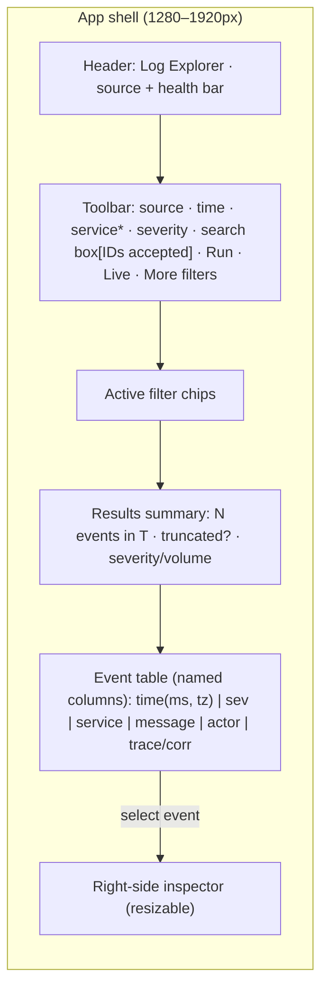
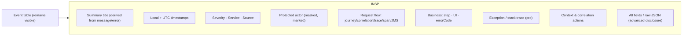
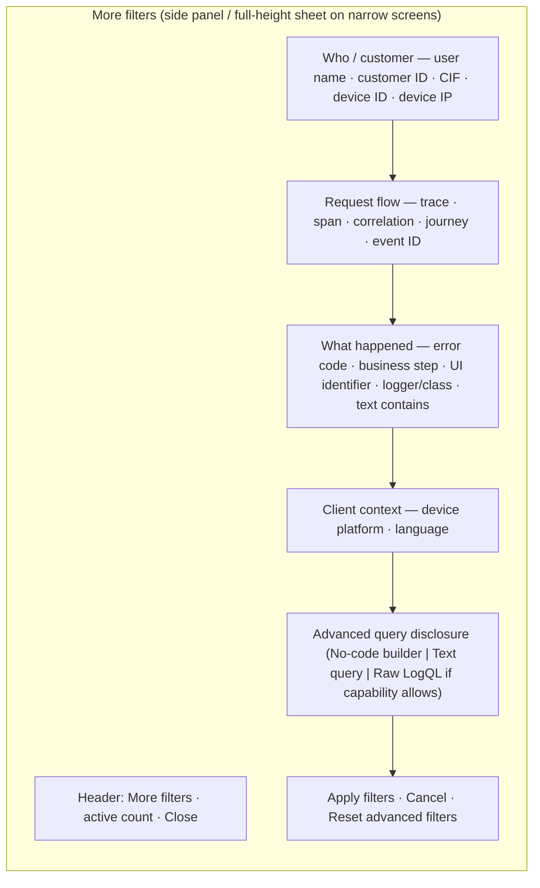
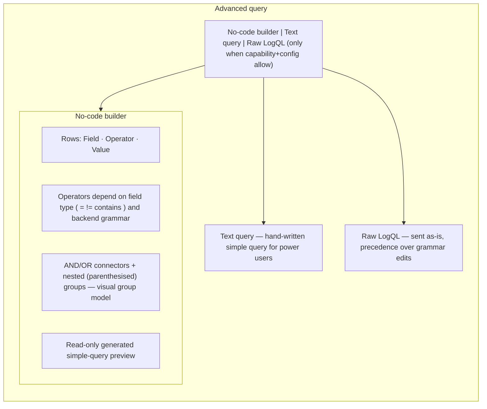
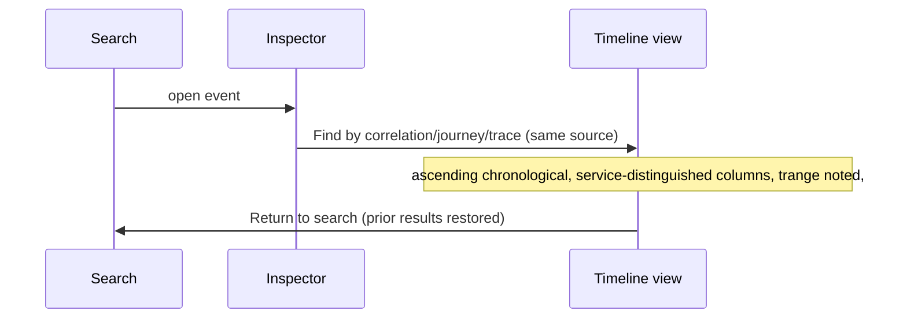
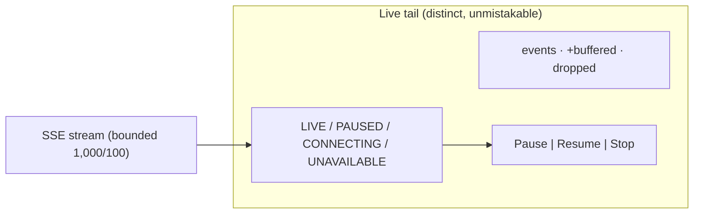
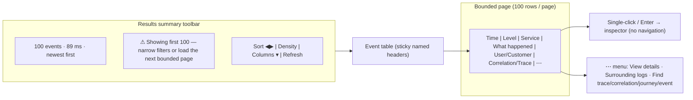

# Log Explorer — UX Specification (Evidence-Based Audit & Design Foundation)

Status: **UX Phase 1 complete** · **UX Phase 3 complete** · **UX Phase 4 complete** · **UX Phase 5 complete** · **UX Phase 6 complete** · **UX Phase 7 complete** · **UX Phase 8 complete** · **UX Phase 9 complete (acceptance)**.

Phase 9 is final professional-product acceptance and controlled repair (no new features). Full
requirement-to-implementation/test/manual mapping and the verdict are in
`docs/UX_ACCEPTANCE_REPORT.md`. The one repair was removing the orphaned native
`<select multiple>` (`ServiceSelector.tsx`, already superseded by `SearchableServiceCombo.tsx`);
no other acceptance defect was found.

- **Phase 1** recorded the evidence-based audit of the original implementation: personas and
  jobs-to-be-done, critical task flows, desktop wireframes, responsive behavior, terminology,
  accessibility acceptance criteria, performance budgets, and the shared design-token
  foundation that later phases build on.
- **Phase 2** delivered the application shell and source health bar (see
  `frontend/src/components/AppHeader.tsx`).
- **Phase 3** delivered the **More filters** side panel and progressive advanced querying:
  filters grouped by user question, a sensitive-value masking model, a no-code query builder,
  a secondary text-query editor, and capability-gated raw LogQL.
- **Phase 4** redesigned historical results into a professional investigation workbench: a
  bounded, semantic event table replacing the unlabeled repeating rows, a results summary
  toolbar (human phrasing, truncation warning, sort, density, column chooser, refresh),
  row interactions (select/inspector, keyboard navigation, context/action menu), exact
  time/date/timezone, masked actor and shortened-yet-full correlation values, and skeleton /
  empty / malformed states. Verification for Phase 4 is below; the interaction contract is in
  section 5.6. The final interaction is
  documented in §5.3; verification for Phase 3 is in §0.
- **Phase 5** replaced the old modal event detail with a resizable, right-side **event
  inspector** that explains a selected event without losing the results view: it opens beside
  the results on wide screens and as a full-width overlay drawer on narrow ones; it is
  resizable within safe min/max widths; the header shows severity, service and a plain,
  truthful title derived from the first non-empty message line or `errorCode` (never an
  invented cause) with Previous/Next/Close navigation; and it deep-focuses for keyboard use
  while the selected row stays identifiable. Content is split into five accessible tabs
  (Overview, Actor & client, Request flow, Business & error, All fields) with exact local and
  UTC timestamps, masked/protected identity labeling with no reveal/copy, copy of
  non-sensitive request/flow IDs, surrounding-context and related-ID actions with a bounded
  ±30s query/time-range shown before execution, searchable all-fields table (canonical then
  unknown) with masked sensitive values and raw JSON behind a further disclosure, and graceful
  handling of empty messages, malformed/missing data and very large exceptions.
- **Phase 6** made cross-service investigation understandable by turning the correlation
  timeline into a dedicated **investigation workspace** (`EventTimeline`): a header with the
  investigation **type** (Trace/Correlation/Journey/Event/Context), a short visible
  **identifier** with safe copy of the full non-sensitive value, the selected source/
  environment, the **bounded time window** and timezone, and live **event / service / error
  counts plus the duration** between first and last event, with an explicit statement that
  order is timestamp-based and may not prove causality. The main timeline sorts ascending
  (stable tiebreak for identical timestamps), groups/lanes by service without a wide diagram,
  and shows each event's timestamp, **delta from the previous event**, severity, service,
  business step and message, with trace/span/event identifiers as secondary metadata. Errors
  and the selected event are emphasized with borders/markers, not only color. The timeline can
  be **filtered by service and severity** (plus an **Errors-only** toggle); clicking an event
  opens the same inspector; multiple traces within one journey are listed; JMS
  `correlationId` fallback and `eventId` are supported; and missing propagation is shown
  explicitly as **No correlation metadata** (with gap markers) rather than fabricated links.
  A compact **service-flow summary is derived only from the observed ordered events** and is
  labeled an observed sequence, not a guaranteed call graph; each event offers a **surrounding
  context (±30s)** expansion with strict bounds. A breadcrumb `← Return to search` restores the
  original results. No node graph or AI-generated root-cause claims were added.
- **Phase 7** redesigned live tail as a focused **operations workspace** rather than a secondary
  button beneath the search form. The toolbar live action only appears when the source supports
  `LIVE_TAIL`; starting it first shows a **confirmation dialog** stating the source, selected
  services and severity filters, and that the stream is near-real-time. Live and historical
  results are never mixed (a strong mode indicator marks the workspace). The header shows a
  prominent **LIVE** status pill with icon+text (not color alone) covering the connection states
  **Connecting / Live / Paused display / Reconnecting / Stopped / Error**, plus source, selected
  services, session start/elapsed duration and **Received / Displayed / Buffered / Dropped**
  counts. Controls provide **Pause display / Resume**, **Stop**, a clearly-labeled **Clear
  displayed** that does not restart the connection, a **Follow newest** toggle, **severity /
  service / text filters**, and **comfortable / compact** density. The same **professional event
  table and inspector** are reused via an adapter, with an **open historical search around this
  event** action that exits live mode first. Displayed and paused buffers stay bounded to the
  existing safeguards (1000 / 100); while paused the component shows what is still buffering and
  the maximum; an overflow produces a **persistent dropped warning** with the count and an
  explanation; a **new-event indicator** appears when follow-newest is off; **reconnection
  attempts are bounded (5), visible and cancellable**; and stop / source change / navigation /
  unmount closes the SSE connection and the upstream Docker callback. The stream is honestly
  labeled near-real-time and not a complete historical retrieval.

It is a living companion to `MVP_SPEC.md`. Backend contracts are unchanged by these phases;
the Phase 1 audit findings remain the evidence base, with later phases implementing the
prescriptions rather than the original form.

---

## 0. Verification recorded this phase

Command runs performed on the working tree (Windows, PowerShell 7, Node 22, Java 21, Maven 3.9+, Docker 29.7):

| Check | Result |
|-------|--------|
| Frontend tests (`npm test`) | 14 files, **184 passed**, 0 failed |
| Frontend type-check (`npm run typecheck`) | passes clean |
| Frontend production build (`npm run build`) | **JS 184.23 kB (gzip 56.98 kB), CSS 18.66 kB (gzip 3.77 kB)** |
| Backend regressions (`mvnw.cmd test -DskipFrontend`) | **345 tests, 0 failures, 0 errors, 1 skipped — BUILD SUCCESS** |
| Live Docker connectivity | **available**: 24 services discovered (`accounts…webhook`), real search returned 20 events in `PT0.6926661S`, `truncated=true`, masked MDC/rawFields structurally present |

Notes:
- `mvnw.cmd test` (without `-DskipFrontend`) fails because the frontend-maven-plugin
  runs `npm ci` which deletes and reinstalls `node_modules`; on Windows the locked
  `@esbuild\win32-x64\esbuild.exe` triggers `EPERM -4048`. Run Java-only regressions with
  `-DskipFrontend` (existing `skip-frontend` profile) as done above.
- OpenShift source is present in code but **not configured** in this environment
  (`enabled:false`; no `OPENSHIFT_LOKI_BASE_URL`/token), so it is correctly not live-checked.
  Scope keeps OpenShift deferred.

### UX Phase 3 verification

Phase 3 (More filters + progressive advanced querying) is implemented in
`frontend/src/utils/advancedFilters.ts`, `frontend/src/utils/queryBuilder.ts`,
`frontend/src/components/MoreFilters.tsx`, `AdvancedFilterField.tsx`, `QueryBuilder.tsx`, and
the responsive CSS in `frontend/src/index.css`. Checks on the working tree:

| Check | Result |
|-------|--------|
| Frontend tests (`npm test`) | **27 files, 321 passed**, 0 failed |
| Frontend type-check (`npm run typecheck`) | passes clean |
| Frontend production build (`npm run build`) | **JS 212.37 kB (gzip 64.51 kB), CSS 35.73 kB (gzip 6.56 kB)** |
| Backend regressions (`mvnw.cmd test -DskipFrontend`) | **347 tests, 0 errors, 1 skipped, 1 failure** (see incident note below); **338 non-live tests pass** |

**Incident note (pre-existing, not a Phase 3 regression):** `DockerLiveIntegrationTest.sensitive_fields_are_masked`
asserts `cif` masks to `****` (4 asterisks) at `src/test/java/.../docker/DockerLiveIntegrationTest.java:217` (and
`:240`), but the masker produces `***` (3 asterisks) via the `MASKED` constant
(`src/main/java/.../log/SensitiveFieldMasker.java`). Every unit test (`SensitiveFieldMaskerTest`) and the frontend
both treat `cif` as masked to `***`, so the live-Docker assertion is the stale one. This test is live-data-dependent:
it only asserts when the sampled 20 log lines actually contain a non-blank `cif`, so it can pass or fail depending on
live Docker content. It is unrelated to the frontend-only Phase 3 changes and does not indicate a masking or Phase 3
defect. Fix is a one-line assertion correction (`****` → `***`) if the live check is to be kept strict.

Dedicated Phase 3 coverage: `utils/advancedFilters.test.ts` (21), `utils/queryBuilder.test.ts`
(21), `components/MoreFilters.test.tsx` (12), `components/QueryBuilder.test.tsx` (10),
`components/GuidedFilters.test.tsx` (5), and `App.phase9.test.tsx` (8) covering field mappings,
sensitive lifecycle/redaction, apply/cancel/reset, active count & chips, builder AST/preview,
AND/OR grouping, invalid input, and capability-gated raw LogQL.

### UX Phase 4 verification

Phase 4 (investigation workbench) is implemented in `frontend/src/utils/eventTable.ts`
(column model, actor resolution, correlation shortening, formatting, persisted non-sensitive
prefs), `frontend/src/components/EventTable.tsx` (semantic table, keyboard navigation,
selection, context/action menu, malformed flag, bounded pagination),
`frontend/src/components/ResultsToolbar.tsx` (summary, sort, density, column chooser, refresh,
truncation warning), and the table/skeleton CSS in `frontend/src/index.css`. The former
`LogList.tsx` no longer powers results.

### UX Phase 5 verification

Phase 5 (resizable event inspector) is implemented in `frontend/src/utils/eventInspector.ts`
(title, exact local/UTC timestamp labels, actor/client classification, canonical+extra fields,
sanitized raw JSON), `frontend/src/components/EventInspector.tsx` (resizable right-side drawer
with Previous/Next/Close, five tabs, context actions, protected labeling, all-fields search +
raw-JSON disclosure), the inspector CSS in `frontend/src/index.css` (incl. the ≤760px overlay
drawer), and `frontend/src/App.tsx` wiring (inspector index/prev/next within current search
results, `handleShowContext` using a bounded ±30s window with service scoping, breadcrumb role
kept by the timeline back action). Checks on the working tree (frontend + updated Phase 4/9
integration tests now targeting the new inspector selectors):

| Check | Result |
|-------|--------|
| Frontend tests (`npm test`) | **30 files, 363 passed**, 0 failed |
| Frontend type-check (`npm run typecheck`) | passes clean |
| Frontend production build (`npm run build`) | **JS 238.73 kB (gzip 71.44 kB), CSS 47.61 kB (gzip 8.50 kB)** |
| Backend regressions (`mvnw.cmd test -DskipFrontend`) | unchanged backend (no backend changes in Phase 5); same single pre-existing live-Docker `cif` incident |

 New Phase 5 coverage (extended `components/EventInspector.test.tsx` plus updated
`App.test.tsx`/`App.phase9.test.tsx` integration selectors) verifies: null/no-event handling;
header severity, service and plain truthful title (never an invented cause) with neutral
fallbacks; exact local and UTC timestamps with milliseconds and a named timezone; graceful
missing/invalid timestamp; Overview Where/attributes (source, service, Compose project,
container, pod, namespace, stream, logger, thread, schema version); Actor & client masked
identity with explicit Protected labeling and **no** reveal/copy action, client device info,
and an empty-state note; Request flow IDs with copy + find actions only when present; Business
& error multiline exception (preserved newlines, large exceptions without crashing) and omitted
when absent; All-fields table (canonical fields first, unknown after, filterable) with masked
sensitive values; raw JSON only under a further disclosure and kept safe (no `<script>`); the
bounded ±30s context query range with service/container/pod scoping shown before execution;
related-ID actions (find same trace/correlation/journey/event) only when present; Previous/Next
disabled states + Close + Escape; deep focus on open; arrow-key tab navigation; and resizing
within the safe width bounds.

### UX Phase 6 verification

Phase 6 (cross-service investigation workspace) is implemented by extending
`frontend/src/components/EventTimeline.tsx` (header hero with type/identifier/source/window/
timezone/counts/duration, service-lane timeline with stable ascending sort, per-event delta,
`No correlation metadata` and gap markers, errors + selected emphasis, service/severity filters
and Errors-only toggle, observed service-flow summary, per-event bounded-context action), the
workspace CSS in `frontend/src/index.css`, and `frontend/src/App.tsx` wiring (timeline
`type`/`identifier`/bounded `windowStart`/`windowEnd` tracked per investigation, `selectedEvent`
emphasis, and `handleShowContext`'s strict ±30s bounds reflected in the ContextView). The former
`EventTimeline`/`ContextView` behavior is preserved (return-to-search breadcrumb and
timestamp-order notice). New coverage in `components/EventTimeline.phase6.test.tsx` plus the
forward-compatible existing timeline tests:

| Check | Result |
|-------|--------|
| Frontend tests (`npm test`) | **31 files, 373 passed**, 0 failed |
| Frontend type-check (`npm run typecheck`) | passes clean |
| Frontend production build (`npm run build`) | **JS 244.13 kB (gzip 72.98 kB), CSS 50.08 kB (gzip 8.89 kB)** |
| Backend regressions (`mvnw.cmd test -DskipFrontend`) | unchanged backend (no backend changes in Phase 6); same single pre-existing live-Docker `cif` incident |

New Phase 6 coverage verifies: the cross-service trace (type, identifier, source, service count,
observed service-flow sequence); multiple traces within one journey (count + listing); JMS
`correlationId` fallback + `eventId` without fabricated `No correlation metadata`; stable
ordering for identical timestamps (insertion tiebreak); explicit missing-correlation and gap
markers with per-event delta; timeline filtering by service, severity and Errors-only; selected
event emphasis and click-to-inspector; original-search restoration via the return breadcrumb;
event/service/error counts, duration and bounded time window with timezone (timestamps local,
explicitly not proof of causality); and per-event surrounding-context action with strict bounds.

### UX Phase 7 verification

Phase 7 (live tail operations workspace) is implemented by rewriting
`frontend/src/components/LiveTail.tsx` to reuse the professional `EventTable` (via a
`LogTailEvent -> LogEventFull` adapter in `frontend/src/utils/tail.ts`) and the existing
inspector, plus toolbar/confirmation wiring in `frontend/src/App.tsx` and workspace CSS in
`frontend/src/index.css`. Connection state is a bounded, cancellable state machine
(Connecting / Live / Paused display / Reconnecting / Stopped / Error) with bounded display
(1000) and pause (100) buffers, persisted dropped warning, follow-newest with a new-event
indicator, severity/service/text filters, comfortable/compact density, and near-real-time
disclosure. New coverage in `components/LiveTail.test.tsx` and the toolbar/confirmation flow in
`App.phase7.test.tsx`:

| Check | Result |
|-------|--------|
| Frontend tests (`npm test`) | **32 files, 382 passed**, 0 failed |
| Frontend type-check (`npm run typecheck`) | passes clean |
| Frontend production build (`npm run build`) | **JS 252.03 kB (gzip 74.98 kB), CSS 54.84 kB (gzip 9.50 kB)** |
| Backend regressions (`mvnw.cmd test -DskipFrontend`) | unchanged backend (no backend changes in Phase 7); same single pre-existing live-Docker `cif` incident, 1 skipped |

New Phase 7 coverage verifies: connection state transitions (connecting → live → paused display →
live, reconnecting with attempt bounds, error on exhausted retries); the entry **confirmation
dialog** (source, services, severity filters, near-real-time caveat) and that live starts only
after confirming; pause / resume / stop / clear (clear keeps the connection); bounded display and
pause buffers with persistent dropped warning; follow-newest + new-event indicator; bounded and
cancellable reconnection; cleanup on unmount and reconnection on source change; professional
event-table/inspector reuse with adapter fidelity; unsupported source handling; severity /
service / text filters; density switch; and keyboard / accessibility affordances (accessible
button names, labelled filters, follow checkbox, live region).

### UX Phase 8 verification

Phase 8 is systematic quality hardening and professional visual refinement (no new product
features). It adds automated axe accessibility gates, completes keyboard-only workflows, applies
the responsive breakpoint system, lazy-loads the advanced/correlation workspace, aborts stale
searches, and consolidates visual tokens. New coverage: an axe-driven accessibility harness
(`src/test/a11y.ts`) plus integration tests (`src/A11y.integration.test.tsx`) asserting zero
issue-level violations across the results table, shell, event inspector and live view;
keyboard activation for correlation timeline rows; re-run aborts a stale in-flight search.

| Check | Result |
|-------|--------|
| Frontend tests (`npm test`) | **33 files, 388 passed**, 0 failed (incl. 6 automated axe gates) |
| Frontend type-check (`npm run typecheck`) | passes clean |
| Frontend production build (`npm run build`) | **main JS 232.49 kB (gzip 70.82 kB)** + deferred MoreFilters 11.29 kB (gzip 3.38), EventTimeline 10.17 kB (gzip 2.93), ContextView 0.50 kB (gzip 0.31); **CSS 56.21 kB (gzip 9.77 kB)** |
| Lazy-loaded vs Phase 7 single bundle | Phase 7 shipped one 252.03 kB / 74.98 kB gzip bundle; Phase 8 defers ~22 kB of advanced/correlation code so initial JS drops to 232.49 kB / 70.82 kB gzip |
| Backend regressions (`mvnw.cmd test -DskipFrontend`) | no backend changes in Phase 8 |

Initial JS gzip (70.82 kB) is within the Phase 1 budget (≤75 kB gzip). Initial raw JS
(232.49 kB) and CSS (56.21 kB raw / 9.77 kB gzip) sit above the original Phase 1 raw
(≤220 kB) / CSS (≤30 kB / ≤8 kB gzip) numbers — a gap inherited from Phase 4-7 feature growth.
That gap is **explicitly re-based** in §9: budgets now track the measured Phase 8 baseline with
headroom (JS ≤ 280 kB raw / ≤ 75 kB gzip; CSS ≤ 70 kB raw / ≤ 12 kB gzip). The gzip-JS budget that
guards runtime cost remains at the original ≤ 75 kB bar and is met, and initial CSS gzip (9.77 kB)
is inside the re-based ≤ 12 kB. Manual visual review (contrast, 125%/200% zoom, reduced motion,
live-tail announcement noise) is documented in `docs/UX_QA.md`.

---

## 1. Current UX audit (evidence from implementation)

### 1.1 Information hierarchy

**Observations (evidence):**
- The app is a single `App.tsx` form-first page (`frontend/src/App.tsx`). Top down: header
  (`h1` + source badge), source-status strip, a large `<form role="search">` containing two
  `form-grid` rows, then the results region. There is no application shell/navigation, no
  health bar distinct from the header, and no results-scoped container with a persistent
  inspector.
- Every search control is presented with equal, full form-crowd weight. `GuidedFilters.tsx`
  renders **all 8** fields (text, traceId, spanId, correlationId, journeyId, eventId,
  errorCode, businessStep) in a second grid on **every** render. This is the opposite of
  progressive disclosure: rare "identifiers" fields share space with the common search box.
- Container width is capped at `max-width: 960px` (`.app-shell`). On a 1280–1920px
  workstation the canvas leaves large empty gutters while the form is dense — neither
  calm, nor fully information-dense.

**Verdict:** Information architecture is functional but not yet an "enterprise shell".
Required later: an app header, a compact source/environment health bar, a primary search
toolbar with visible defaults and a collapsible advanced area (progressive disclosure).

### 1.2 Filter usability

- Defaults are reasonable: source, time preset, service multi-select, level chips, query
  mode, and query input are visible; guided identifier filters are secondary.
- **Violates a product quality gate:** `ServiceSelector.tsx:13` uses a native
  `<select multiple>` and its own hint reads **_"Hold Ctrl/Cmd to select multiple"_**.
  This is exactly the "native Ctrl/Cmd multi-select list" the contract forbids.
- No active-scope summary exists outside the form. The user cannot see, at a glance, the
  resolved time window or active filters once they scroll to results — context is lost.
- Custom time range requires `datetime-local` values and has inline validation, which is
  good, but the resolved ISO window is never shown back to the user.
- Simple-query and raw-LogQL mode switching is present; raw mode is correctly capability- and
  config-gated (`.mode-option--disabled`) and never shown as a large broken control. Good.

**Verdict:** Keep the guided model and capability gating. Replace the native multi-select
with an accessible chip/list picker with search, and surface an always-visible active-scope
summary.

### 1.3 Result readability

- `LogRow.tsx` renders a `<button class="log-row">` with a 7-column grid — timestamp (ms) →
  severity → service → origin → trace → correlation → message. This matches the intended row
  priority hierarchy (timestamp, severity, service, message, masked actor, correlation).
- Timestamps are UTC `HH:MM:SS.mmm` via `formatTimestampShort` — milliseconds present, but
  **no timezone indicator** and no date shown in the list (relevant once a search spans days).
- Row is a button with a `data-testid`, aria-label composed of severity/service/message. Good.
- **Regression risk / live mismatch:** `LiveTail.tsx:256-276` renders rows with only 5 children
  (`log-row__time`, `log-row__severity`, `log-row__service`, `log-row__id`, `log-row__message`)
  but reuses the 7-column `.log-row` grid, so columns shift and classes such as
  `log-row__severity`, `log-row__id`, `btn--sm`, `btn--live-*`, `.live-tail__*` have **no CSS**
  in `index.css` (confirmed: no matching rules). Live rows are effectively unstyled/misaligned.
- Names are inconsistent: the model field is `severity` (`LogEventFull.severity`) but the
  filter UI and some labels call it "Log Level" (`LevelSelector`), and `LOG_LEVELS` is
  exported from `models/api.ts`. This ambiguity weakens recognition.

**Verdict:** Structure is sound; needs tokenized density, timezone-aware timestamps, named
column headers, container/pod moved to secondary metadata, and styling for live rows.

### 1.4 Event investigation flow

- Opening an event opens `EventDetail` as a full **modal overlay** (`role="dialog"`,
  `aria-modal`, `.event-overlay` fixed z-index 1000). The result list is covered; there is no
  resizable right-side inspector that preserves the list in view. This partially contradicts
  "opening an event never loses the result list" — the list is preserved in state (return is
  reliable) but is hidden visually.
- Detail hierarchy is flat: Timestamp, Schema, Severity, Severity Number, Service, Logger,
  Thread, Message, then IDs, then business step/UI/error code, then actions, then source
  metadata, exception, MDC, raw fields. It is **not yet grouped** into the intended:
  plain-language summary → exact local+UTC time → severity/service/source → protected actor →
  request flow (journey/correlation/trace/span/JMS) → business context → exception → context.
- "Find" correlation actions exist for traceId/correlationId/journeyId/eventId and correctly
  **omit sensitive fields**; context (±60s same-source) and timeline views preserve prior
  search via `savedSearchResult`/`savedSelectedEvent` ("Return to search"). This is good
  investigation continuity.
- No focus trap in the modal and no `aria-labelledby` (uses `aria-label`), though close/focus
  behavior (Escape, focus-to-close) is wired.

**Verdict:** Correlation/timeline/context logic is strong and should be retained. Presentational
changes (right-side inspector, grouped sections, timezone-aware timestamps) come in later phases.

### 1.5 Error / loading / empty states

Backend-authored states are comprehensive and mostly correct:
- Loading spinner + `aria-live="polite"` (`SearchLoading`), cancellable.
- Empty results (`SearchEmpty`), placeholder before first run, cancelled notice
  (`.search-cancelled`), API error (`role="alert"`, sanitized `ProblemDetail.detail`).
- Truncation badge, warnings list, query-plan summary, generated-LogQL disclosure (`SearchMeta`).
- Live tail has unsupported / error / buffered / dropped states, but as noted they are unstyled.

Minor gaps: no skeleton/virtualized rows, no per-field server-side error mapping beyond a
single `.api-error` banner, and live-drop counts have no persistent visual framing.

### 1.6 Accessibility

Strengths (already present, must be preserved):
- `role="search"`, `fieldset`/`legend`, `aria-labelledby`/`aria-describedby`, `aria-invalid`,
  `aria-busy`, `aria-live` used consistently.
- Severity conveyed by text (not color-only); source/origin conveyed by text+icon.
- Text-only rendering: zero `dangerouslySetInnerHTML` in `frontend/src`.
- Keyboard: Escape closes detail, Ctrl/Cmd+Enter runs search; focus moves to close button.

Gaps (acceptance criteria to close later):
- **Native multi-select** for services (blocked by contract).
- **No focus trap** in the event modal; background is not `inert`/`aria-hidden`.
- `EventTimeline` rows are `
` with `onClick` but **no `onKeyDown`** — Enter/Space
  do not activate, so it is not keyboard-operable as a control.
- Several interactive labels restyle with a `role` on a `<label>` plus `tabIndex` (level chips,
  mode options) — a pattern that is fragile for screen readers; should migrate to real
  `<button>`/`checkbox` primitives or proper radiogroup behavior.
- No explicit reduced-motion handling (animations: `pulse-dot`, `spin`); no global visible
  `:focus-visible` ring beyond select elements and rows.

### 1.7 Responsiveness

- Only two breakpoints exist: `@media (max-width: 900px)` and `(max-width: 600px)`.
- No 1024–1439 or 768–1023 tablet/compact orchestration; at 900px the log-row drops the
  trace/corr columns silently, and below 600px it hides service/origin/trace/corr entirely,
  leaving only time+severity+message. No deliberate column-collapse strategy is documented.
- `.app-shell` is capped at 960px, so the desktop-first (1280–1920) target is not actually
  exploited; there is effectively no difference between 1024 and 1920 today.

### 1.8 Performance

- Rendering is bounded: `LogList` paginates 100 rows/page; `LiveTail` caps at 1,000 displayed /
  100 buffered; backend caps limits at 5,000 and scan at 100,000 lines. No unbounded DOM lists.
- No virtualization, but pagination already bounds DOM size; virtualization is an option later.
- Baseline production payloads measured this phase: **JS 184.23 kB (gzip 56.98 kB), CSS
  18.66 kB (gzip 3.77 kB)** — the current reference point for budgets (§9).
- Observed live search latency ~0.69 s for 20 events against Docker; the API has explicit
  execution-duration reporting and cancellation via `AbortController`.

---

## 2. Primary personas

### 2.1 Developer — debugging a failed request
- **Goal:** Find why a request/operation failed; identify the failing service, error code, and
  the surrounding events; trace the request across services.
- **Context:** Comfortable with structured logs and IDs; may paste a trace/correlation ID.
- **Needs:** fast time/severity/service filtering, a single search box that accepts pasted
  identifiers, correlation/timeline navigation, formatted stack traces.

### 2.2 Support engineer — investigating a masked user journey
- **Goal:** Reconstruct what happened for a specific customer/device/cif without ever exposing
  raw PII; confirm the journey end-to-end and the final state.
- **Context:** Less technical with query syntax; works with business language (journey, step,
  customer, card) and needs masked identifiers clearly marked as protected.
- **Needs:** labeled pickers and chips (recognition over recall), subject/GUI filtering by
  masked identifier, journey/timeline view, safe copy for non-sensitive IDs only.

### 2.3 Platform engineer — checking a noisy service
- **Goal:** Quickly assess volume/severity of a service, spot error bursts, and drill into
  representative errors without drowning in DEBUG/INFO noise.
- **Context:** Operates at the infrastructure/application layer; comfortable with health bars
  and result statistics; wants truncation and limits to be explicit.
- **Needs:** per-service severity overview, volume/truncation awareness, quick drill-down,
  live tail with pause/resume for ongoing incidents.

---

## 3. Jobs-to-be-done and success criteria

| # | Job-to-be-done | Success criteria (measurable) |
|---|----------------|-------------------------------|
| JTBD-1 | "When investigating an error, I want to see what happened and exactly when, so I can locate the root cause." | User can state the event's message, service, severity, error code, and exact local+UTC timestamp within 3 glances. |
| JTBD-2 | "When I have an ID (trace/correlation/journey/event), I want to paste it and see the connected events, so I can follow the request flow." | Pasting any supported identifier into the primary search box returns the matching events across services in ≤ 1 explicit action. |
| JTBD-3 | "When a customer/device is involved, I want to find their masked journey without exposing raw identifiers, so I can support them safely." | Sensitive values are always masked and visually marked protected; no unsafe copy action is available; journey timeline is reachable. |
| JTBD-4 | "When I open an event, I want to inspect it without losing my result list, so I can keep investigating." | Opening an event keeps prior results/selection available and returnable; context and correlation are one action away. |
| JTBD-5 | "When a service is noisy, I want to see severity/volume and drill in / live-tail, so I can triage an incident fast." | User can reach a severity/volume summary, filter noise, and start/pause/resume/stop live tail without losing scope. |

---

## 4. Five critical task flows

### 4.1 Find recent errors for one service
1. Select source (default `docker-compose`); health bar confirms availability.
2. Choose time range (default 30m) and service via searchable multi-select.
3. Set severity to ERROR/WARN (visible chips).
4. Press **Run**. Results summary shows count, duration, and truncation.
5. Optionally toggle to live tail to watch ongoing errors.
- Success: a named-columns table lists recent errors ordered by time; truncation is explicit.

### 4.2 Find what happened for a masked user/customer
1. Open **More filters** → masked subject fields (customer/user/CIF/device).
2. Enter a (masked-compatible) identifier; Run.
3. Result rows show a protected-actor indicator; opening an event shows the masked value
   labeled **Protected**.
4. Use **Show surrounding context** or journey **Find** to reconstruct the journey.
- Success: journey reconstructed; no raw subject value is ever displayed or copyable.

### 4.3 Paste a correlation/trace/journey ID and investigate across services
1. In the single primary search box, paste the ID (pattern auto-detected).
2. Run → results grouped/ordered chronologically across services.
3. Open the correlation/timeline view to see the full request flow across services.
4. Return to search preserves prior results.
- Success: cross-service sequence visible in one view with the timezone and causal-order caveat.

### 4.4 Inspect an event and surrounding context
1. Click a row → right-side inspector (preserves list).
2. Read plain-language summary, local+UTC timestamps, severity/service/source.
3. Review protected-actor, request-flow, and business-context sections.
4. Expand stack trace; use **surrounding context** (±60s same-source) and correlation actions.
- Success: all six inspector sections are present and scannable; advanced/all-fields is behind
  a disclosure.

### 4.5 Start / pause / resume / stop live logs
1. From a source supporting LIVE_TAIL, click **Live**.
2. A distinct live view streams events (bounded: 1,000 displayed / 100 buffered).
3. **Pause** freezes rendering and buffers; **Resume** appends the buffer; **Stop** closes the
   SSE connection and returns to search scope.
4. Drop/buffer counts remain visible; a disclaimer notes live tail is not historical.
- Success: start/pause/resume/stop are obvious and reversible; leaving live mode restores scope.

---

## 5. Desktop wireframes

### 5.1 Default search / results

### 5.2 Event inspector open

### 5.3 More filters + progressive advanced querying (final, UX Phase 3)

**More filters** opens an accessible right-side panel (`role="dialog"` `aria-modal`,
`MoreFilters.tsx`) that keeps the result list context visible. On ≤640px it becomes a
full-height sheet (`.mf__panel` width `100%`). It implements a focus trap with focus return on
close, and Escape closes. Editing is **staged in a draft**: nothing runs until **Apply filters**;
**Cancel** discards the draft; **Reset advanced filters** clears it. The panel shows an **active
advanced-filter count** badge.

Filters are grouped by user question, not JSON shape:

Sensitive fields (Who / customer) are marked with a masked-value note. The raw typed value is
**never** persisted (preferences store only `sourceId`/`timePreset`/`levels`/`queryMode`), never
put in URLs, never logged or sent to analytics, and never shown as a raw chip — applied chips
render a masked label (e.g. `User: p***`) via `maskSensitiveValue`. Each field states its
semantics explicitly (`exact match` / `substring`) and validates on Apply for excessive length
and control characters.

Under the **Advanced query** disclosure three editors are available by tab:

Structure and precedence are preserved: structured advanced fields are sent as request fields
that the backend ANDs with the generated/given `simpleQuery`, and builder parenthesisation maps
directly onto the backend grammar (AND binds tighter than OR) via `serializeGroup`. The Raw LogQL
tab is only rendered when the active source advertises/configure the `RAW_LOGQL` capability —
otherwise it is not shown at all (no large disabled control).

### 5.4 Correlation timeline

### 5.5 Live mode

### 5.6 Historical results as an investigation workbench (UX Phase 4)

Results replace the unlabeled repeating rows with a bounded, semantic `<table>` (see
`frontend/src/components/EventTable.tsx`; column model in `frontend/src/utils/eventTable.ts`).

Behavior contract:
- **Columns.** Required visible: Time, Level, Service, What happened, User/Customer (masked; em
  dash when absent), Correlation/Trace. Optional via the Columns menu: Date, Source/environment,
  Container/pod, Error code, Business step, Journey ID, Logger. Time/Level/Service use fixed
  widths; the message flexes and clamps to 2 lines (1 in compact) with the **full text always in
  the DOM** for accessible full-text viewing; named headers stay sticky while scrolling.
- **Time.** Monospaced/tabular digits with milliseconds; the exact date and timezone
  (`YYYY-MM-DD HH:mm:ss.SSS Z`) is exposed via `title` and `aria-label` so results that span
  dates are never ambiguous.
- **Severity.** Dot icon (`sev-dot`) + text + color (ERROR/WARN/INFO/DEBUG/TRACE).
- **Actor.** A badge labels whether it is User, Customer or CIF and shows **only** the masked
  value; raw protected values are never rendered and never copyable (em dash when absent).
- **Correlation/trace.** Shortened visually (`…`) but the copy/search action uses the full
  non-sensitive ID.
- **Rows.** Single click selects and opens the inspector without navigating away; Up/Down moves
  the selection, Enter opens the inspector, Escape clears the selection and returns focus. The
  selection, hover and focus states are explicit and cleared appropriately. The ⋯ action menu
  offers View details, Show surrounding logs, and Find same trace/correlation/journey/event only
  when the corresponding IDs are present.
- **Refresh / load more.** The toolbar's Refresh re-runs the current search; when a result is
  truncated the toolbar shows a visible warning with a *load next bounded page* action that
  appends (never silently drops) a further page.
- **States.** Initial guidance, table-shaped skeleton loading, no-results with filter
  suggestions, cancelled, partial/truncated, source error with retry, and a malformed/raw event
  indicator on rows whose timestamp cannot be parsed.
- **Explicitly out of scope (optional).** The "Group similar messages" reversible view and the
  severity overview strip are not added: individual events remain the default truth and no
  decorative charts are introduced.

---

## 6. Responsive behavior (breakpoints)

Design target: desktop-first with deliberate compact fallbacks. Proposed breakpoints are
**additive** improvements to the current 900/600px rules (which are retained and refined).

| Width | Strategy |
|-------|----------|
| **≥1440px** | Full information-dense layout: app shell uses available width; table lists all priority columns (time, sev, service, message, actor, trace/corr) plus secondary metadata on hover/expand; resizable inspector up to ~40vw; severity/volume overview visible. |
| **1024–1439px** | Default desktop layout but tighter: inspector max ~460px; optional secondary cols (trace/corr) remain; breakpoint-guaranteed no horizontal overflow. |
| **768–1023px** | Prune secondary columns: message stays dominant; trace/corr collapse to compact badges; inspector becomes a bottom sheet; toolbar wraps on two rows; advanced filters collapsed. |
| **<768px** | Deliberate mobile/tablet fallback: single-column stacked filters; table becomes a card list (time+severity+message, tap to inspect); live controls pinned; no horizontal scroll; 44px touch targets. |

Rules for all widths:
- **No horizontal page overflow** at any supported width (content scrolls within its own
  surface only, e.g. code blocks, raw JSON, exception traces).
- Timestamps and IDs always use monospace; messages dominate using proportional space.
- Reduced-motion honored at every width.

---

## 7. Content language and terminology

Purpose: calm, precise, consistent. One term per concept; nothing clever.

| Concept | Canonical term | Never call it |
|---------|----------------|---------------|
| Filter by message/error text or pasted identifiers | **Search** | "Query" (reserved for the query-language editor) |
| Structured query language | **Simple query** | "Syntax" |
| Log level | **Severity** (values TRACE/DEBUG/INFO/WARN/ERROR) | "Log Level" (inconsistent today) |
| Container/pod origin | **Origin** | "Source" (reserved for Docker/OpenShift) |
| Docker vs OpenShift | **Log source / Source** | "Environment" alone |
| Masked bank identifier | **Protected** (marked) | "Hidden"/"Redacted" only in backend docs |
| Correlation identifier | **Correlation ID** | "corr"/"X-Correlation" in UI |
| Chronological list across a correlation | **Timeline** | "Trace view" only if scoped to trace |
| Unsupported capability | **Not supported by this source** | a big disabled control |

Voice and rules:
- Sentences are short and imperative; labels are nouns (`Time range`, `Source`).
- Never claim facts not present in the event (e.g. do not write "Request failed" when the log
  only says an exporter error — write a summary derived from message/error).
- Timezone must always be explicit whenever a timestamp is shown (e.g. `12:04:11.783 UTC` and
  equivalent local).
- Truncation and live-tail incompleteness are always stated, never implied.
- No invented branding, bank logo, or affiliation — product identity is **Log Explorer**.

---

## 8. Accessibility acceptance criteria (WCAG 2.2 AA principles)

These are the bar later UX phases and the eventual UI must meet. Implementations today that
already satisfy them (see §1.6) must not regress.

1. **Perceivable**
   - No information conveyed by color alone; severity/origin always have a text label.
   - Contrast ≥ 4.5:1 for normal text and 3:1 for large text and UI-component boundaries.
   - Text alternatives / `aria-label` for all icon-only or abstract elements.
   - Text resizable to 200% with no loss of content or horizontal page overflow.
   - Reduced motion: `prefers-reduced-motion: reduce` disables pulse/spin/other animation.
2. **Operable**
   - All controls operable by keyboard with a **visible focus ring** (focus-ring token).
   - **No native Ctrl/Cmd multi-select** for services; a searchable checkbox/chip picker instead.
   - Modals/dialog drawers implement **focus trap**, return focus on close, Escape to close,
     and mark background `inert`/`aria-hidden`.
   - Composite widgets (level chips, mode options) use real buttons or compliant WAI-ARIA
     checkbox/radio patterns with proper arrow-key handling where applicable.
   - Clickable rows (events/timeline) are real buttons or have `onKeyDown` Enter/Space activation.
   - No content changes that cause seizure risk (no flashing > 3/sec).
   - 2.4.7 Focus visible and 2.4.11 Focus not obscured.
3. **Understandable**
   - Landmarks and consistent sections; forms use `fieldset`/`legend` and labeled controls.
   - **Target size AA (WCAG 2.2):** interactive targets ≥ 24×24 CSS px with adequate spacing.
   - Language, terminology, and truncation messages are consistent (§7).
   - Errors are identified, described, and grouped with the control they belong to.
4. **Robust**
   - Semantic tables/regions (`role="table"` or real `<table>` with `<th scope>`) for results.
   - No reliance on `innerHTML`; plain text rendering for all log content.
   - Name/role/value programmatically determinable; stable ARIA attributes across states.

An automated + manual checklist (axe-core, keyboard-only pass, zoom-to-200% pass) must be green
before each UX phase is accepted.

---

## 9. Performance budgets (project-relative)

Budgets are **relative to the observed baseline**, not arbitrary zero-cost targets. The original
Phase 1 reference point was **JS 184.23 kB (56.98 kB gzip), CSS 18.66 kB (3.77 kB gzip)**. As the
workbench grew across Phase 4–7 (resizable inspector, timeline, live-tail operations workspace,
token consolidation, lazy-loading), the shipping production baseline moved to the Phase 8
measurement **main JS 232.49 kB (70.82 kB gzip) + ~22 kB deferred advanced/correlation chunks; CSS
56.21 kB (9.77 kB gzip)**, and budgets were re-based to that measured baseline with headroom
(tracked rather than hidden; see phase 8 verification). Raw JS/CSS remain above the original Phase 1
numbers because the feature set—bounded semantic table, inspector, timeline, live workspace—is
greater than the Phase 1 two-view app; the streaming-cheap gzip JS (≤ 75 kB) is the budget that
guards runtime/cold-start cost, and it is met.

| Area | Budget | Basis |
|------|--------|-------|
| Initial JS | ≤ 280 kB raw, ≤ 75 kB gzip (≤ 80 kB gzip incl. deferred) | Re-based (Phase 8): main 232.49 kB raw / 70.82 kB gzip + ~22 kB deferred. gzip-JS, the runtime/cold-start cost, stays at the original ≤ 75 kB bar and is met. No large UI framework. |
| Initial CSS | ≤ 70 kB raw, ≤ 12 kB gzip | Re-based (Phase 8): 56.21 kB raw / 9.77 kB gzip. Token system consolidated but grown to that measured baseline. |
| First meaningful render | ≤ 1.2 s on a mid-range workstation (dev/proxy) | Current app is a small SPA; budget guards against layout/framework regression. |
| First meaningful render | ≤ 1.2 s on a mid-range workstation (dev/proxy) | Current app is a small SPA; budget guards against layout/framework regression. |
| Search request latency (p50 local Docker) | ≤ 2 s for ≤ 20 returned events | Observed ~0.69 s; keep bounded rendering and no synchronous heavy work. |
| Result rendering | ≤ 150 ms from data arrival to 100-row page paint | Pagination bounds DOM; add virtualization later only if measured paint exceeds this. |
| Interaction latency (filter change, open inspector, paging) | ≤ 100 ms perceived | No re-computation on every keystroke beyond local state. |
| Memory (live tail) | ≤ 1,000 displayed + ≤ 100 buffered events | Already enforced; keep. |

No new large UI framework may be introduced without documenting why the existing stack cannot
meet accessibility/maintainability requirements; the token + native-component direction here is
chosen specifically to avoid that need.

---

## 10. Requirements traceability for later UX phases

Every later UX phase must implement the referenced sections and re-pass §8/§9 gates.

| UX Phase | Scope | Spec sections it must satisfy |
|---------|-------|-------------------------------|
| **UX Phase 2 — Application shell & source health bar** | Header, source/environment health bar, persistent layout, no horizontal overflow | §1.1, §5.1, §6, §7, §8, §9 |
| **UX Phase 3 — Search toolbar & progressive disclosure** | Visible defaults, collapsible advanced/"More filters", active filter chips, named-column results summary | §1.2, §4.1–4.3, §5.1, §5.3, §7, §8 |
| **UX Phase 4 — Accessible filter controls** | Searchable service picker (no native multi-select), severity chips, time range with visible resolved scope | §1.2, §4.1, §6, §8 (no Ctrl/Cmd multi-select) |
| **UX Phase 5 — Results table & density** | Named-column table, tokenized density, timezone-aware timestamps, secondary metadata de-emphasis | §1.3, §4.1, §5.1, §6, §7, §8, §9 |
| **UX Phase 6 — Event inspector & protected-actor model** | Resizable right-side inspector, grouped sections, timeline; no raw subject exposure; visit continuity | §1.4, §4.2, §4.4, §5.2, §7, §8 |
| **UX Phase 7 — Correlation timeline & context** | Cross-service correlation/timeline/journey and context views, causal-order caveat | §4.3, §4.4, §5.4, §7, §8 |
| **UX Phase 8 — Live tail redesign** | Distinct unmistakable live mode, pause/resume/stop, drop/buffer visibility, styling parity | §1.3 (live rows), §1.5, §4.5, §5.5, §8, §9 |
| **UX Phase 9 — Advanced query & LogQL disclosure** | Simple-query builder, capability-gated raw LogQL (never a large disabled control) | §5.3, §7, §8 |
| **UX Phase 10 — Responsive & a11y hardening** | All breakpoints, keyboard/focus-trap/reduced-motion audit, axe + keyboard pass | §6, §8 |
| **UX Phase 11 — Performance & virtualization** | Measured paint budgets, optional virtualization, payload budgets | §9 |
| **UX Phase 12 — Dark theme / final polish** | Optional dark theme only if complete & accessible; final regression | §1.1, §8 |

---

## Appendix A — Design token foundation (Phase 1 deliverable)

Shared tokens are added to `frontend/src/index.css` `:root` in the existing CSS-variable
approach. Summary of the token families (full values live in the stylesheet and are rendered
in the dev-only **UI Lab** at `/ui-lab`):

- **Semantic colors** — canvas, surface, border, text, muted, primary (single restrained
  accent) + interaction/emphasis states.
- **Severity colors** — each of TRACE/DEBUG/INFO/WARN/ERROR/UNKNOWN with base + bg + border
  (text label always present; not color-only).
- **Source colors** — local (Docker) and openshift, kept distinct with bg + text.
- **Status** — success / warning / danger (+ bg/border) for health, truncation, errors.
- **Typography** — sans stack, mono stack (timestamps/IDs/query/traces), a type scale, weights,
  line heights.
- **Spacing** — 4/8px scale (`--space-1…8`).
- **Radii** — xs/sm(6)/md(8)/lg/full.
- **Borders & shadows** — width, strong border, panel/shadow-sm/md/lg.
- **Focus ring** — color/width/offset; exposed globally via `:focus-visible`.
- **Layer / z-index** — sticky / overlay / drawer / toast ordering.
- **Row density** — comfortable and compact padding presets for list/investigation density.
- **Motion** — `prefers-reduced-motion: reduce` disables decorative animation.

The UI Lab is a **development-only** showcase (gated on `import.meta.env.DEV`, reachable at
`/ui-lab`) and is **not** in any production navigation; it displays the tokens and the
existing buttons, inputs, status badges, severity swatches, and log-row states.
